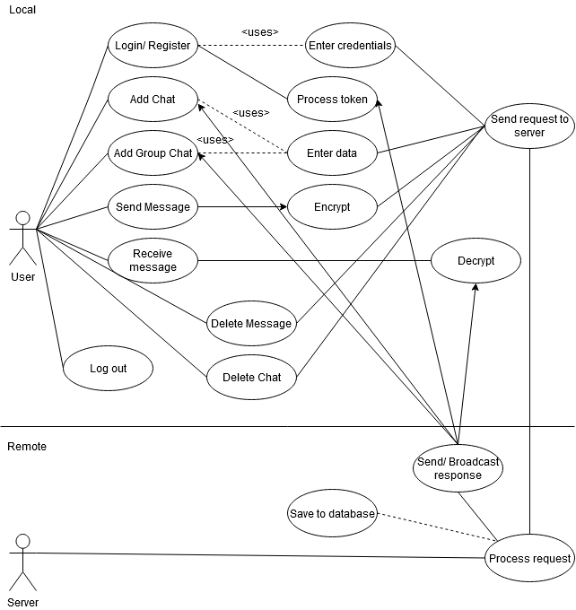
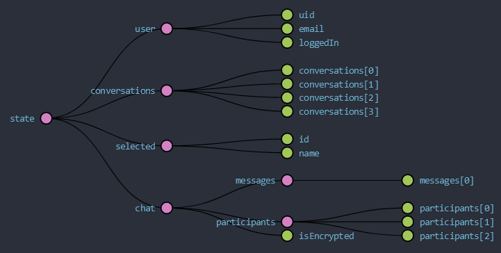
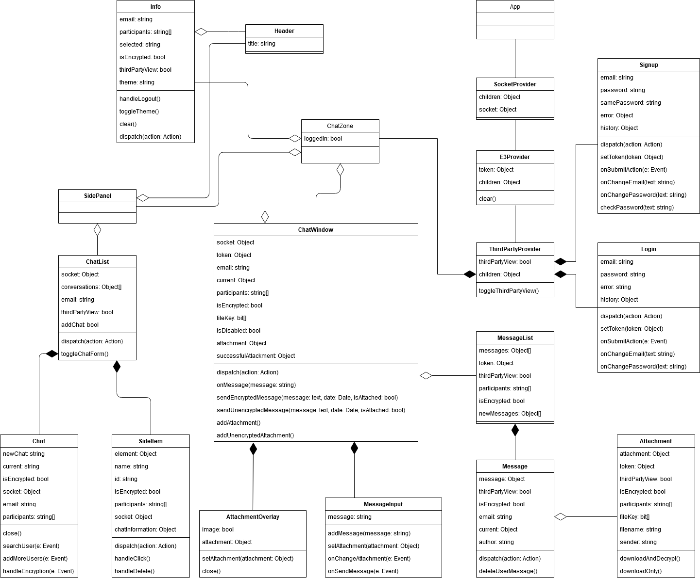

\newpage
\pagenumbering{arabic}

# Introduction

As online communication gained more popularity, using instant messaging applications has become a standard in our quotidian lives. Therefore, the users need assurance that their conversations remain private and that there is no third party spying on them. 

Messaging applications with end-to-end encryption have been around since 2012, with iPhone's iMessage and Threema, then Signal in 2013. This practice became more popular in 2016, when Whatsapp announced the introduction of end-to-end encryption by default in the application[@whatsapp_whitepaper] and Facebook Messenger added the Secret Chats feature with similar properties [@facebook_signal], [@facebook]. Also, Signal was given constatly given endorsement throughout the time [@snowden], [@elon].

End-to-end encryption is used to protect the privacy of the messages sent between two or more participants, as they are in transit or at rest, with the intended recipients being the only ones that can decrypt and read the messages. Thus, the third parties, like service providers, servers, governments etc. interested in intercepting the data sent are unable to see the actual plaintext and there is no need for the users to trust them. Also, the messages' contents are protected against possible data breaches. 

Moreover, compliance with regulations regarding data privacy and security becomes easier for the service providers. 

But the cost of benefits is paid with a number of limitations. An example would be user matadata collection, which can be used for surveillance, detecting the social graph, advertising. This issue was tackled by Signal with its Sealed Sender feature[@sealed_sender]. 

Also, backdoors are heavily requested by governments in order to protect the citizens and national security [@justice_dep], [@eu] and, therefore, spam and abuse becomes harder to control on end-to-end encrypted platforms. More will be discussed in [Section 2](#theoretical-aspects), along with a brief presentation of the cryptographic concepts used throughout the thesis.

The aim of this thesis is to create an overview of the end-to-end encryption protocols in popular instant messaging apps and their mechanisms and to explore the ways in which they handle various issues, including the aforementioned ones. The topics that will be discussed are their current implementations and innovations in the field, as well as past security issues. The protocols analyzed are Signal, MTProto, Signcryption, Letter Sealing and Threema, in [Section 3](#existing-technologies). 

The final section, [Section 6](#conclusions) is reserved for a final comparison and conclusions. 

## The application

The application is a web-based instant messaging application which provides end-to-end encryption, by default, for both private and group chats. It supports sending text messages and attachments. 

In order to illustrate the differences between end-to-end encrypted and unencrypted messaging applications, on a simplified scale, the user can initiate unencrypted chats with other users. To have a better view of the implications of this, they can choose to "see through a third party's view", which shows what is available to the server and anyone controlling it, including metadata and messages in plaintext, for unencrypted chats. 

The frameworks, libraries and platforms that were used for this application are presented in [Section 4](#technologies-used) and details about the implementation and aplication are given in [Section 5](#the-application).

\newpage

# Theoretical Aspects

In this chapter, some of the main concepts that will be used throughout the thesis are presented. More information is given in [Section 3][#existing-technologies]. 

## Symmetric key encryption

Symmetric-key encryption is an encryption scheme which uses the same key for both encryption and decryption. In this case, the key must be a shared secret between the communicating parties, which might result in security issues if the key is intercepted, if it is sent through an insecure channel. 

An advantage of this type of algorithms is that they are more efficient in terms of software and hardware. 

## Public key encryption

Public-key encryption, or asymmetric encryption, is an encryption scheme which uses a public and a private key pair for each user. The public key is known and can be publicly distributed, so sending it through an insecure channel is not an issue anymore, but the private key must be kept secret by the user. To encrypt a message, the sender uses the public key of the receiver, which can be decrypted only using the recipient's private key. 

The security of this encryption scheme resides on the property of the key pair that, while knowing the encryption key, it must be computationally infeasible to obtain the plaintext message from a random ciphertext, so obtaining the decryption key.

A drawback of public key encryption is that it is less efficient than symmetric key encryption but it can be used as a secure channel for key exchange or for encrypting smaller data sets. 

## Attacks

There are various attack vectors that can be identified on cryptosystems. Their aim is to obtain the private key based on information that can be collected from plaintext or ciphertext. Some of them are briefly presented below. 

The **ciphertext only attack** involves an attacker who has access to the ciphertexts and can is successful when the plaintext can be obtained from a set of ciphertexts. The encryption key can be determined afterwards. Modern cryptosystems are not affected by this type of attack anymore.

In the **known plaintext attack**, the attacker has the plaintext and corresponding ciphertext and its aim is to obtain the key. This type of attack works on simple ciphers. 

**Impersonation** refers to an adversary that can place themselves in the communication between two parties, A and B, and send their public key such that A thinks it was B's public key. In this way, the adversary can decrypt the message, read, alter it before encrypting it with B's key and sending it forward. This kind of attack can be mitigated using authentication. 

The adversary in a **chosen plaintext attack** chooses arbitrary plaintext and then is given the corresponding ciphertext. The intention is to reduce the security of the encryption scheme and it can be mitigated by providing semantic security, meaning that the adversary should not be able to obtain other that negligible information from the ciphertext. This property is also called indistiguishability under chosen plaintext attacks. 

This attack can be classified further into batch attacks, when the adversary knows the plaintext before seeing the corresponding ciphertext and adaptive attacks, in which the adversary can query more ciphertexts based on ciphertexts of the previously queried plaintext. 

In **chosen ciphertext attacks**, the adversary has access to the plaintext of chosen ciphertexts and the intention is to obtain the privete key. They can be split in two categories, too: indifferent or "lunchtime" attack and adaptive attack. 

In a "lunchtime" attack, the attacker can receive decryptions of any chosen ciphertext until a certain point, until the device, or decryption oracle, is not unattended anymore. In adaptive chosen ciphertext attacks, the adversary is only allowed to choose ciphertexts related to the target one and obtain enough information to decrypt it. 

To avoid such attacks, the attacker should not have access to a decryption oracle, for example. An encryption scheme secure against CCAs is indistinghiusable under chosen ciphertext attacks. 

**Brute force attacks** are the slowest and consist of trying all the possible keys until the message is decrypted.

**Side channel attacks** are more concerned on the way the computer system is implemented, not on the implementation of the algorithm itself. Usually physical, the information that can be used against a cryptosystem consists of power usage, the amount of time the process takes, sounds or electromagnetic radiation leaks.

## Authentication

Authentication is the process of proving the identity of an entity, called claimant, to a verifier and preventing impersonations. It might be done using certain credentials (a password) or with a digital certificate (in case of websites). 

The process of entity authentication finishes with acceptance or rejection. That is, if a party A authenticates to B, then B accepts the identity of A and none of them can impersonate the other to another party C. There is also an objective that if C tries to impersonate A, there is a neglijible change that B will authenticate A. 

A form of authentication is data origin authentication or message authentication. These are techniques that assure one party of the identity of the sender. Usually, the message has additional information attached so the receiver can determine it. 

### Message authentication codes

MACs (Message authentication codes) are authentication tags created from the message and the secret key and they protect the authenticity and integrity of the message. They use symmetric schemes and the key is also used to verify the MAC and to confirm that a message was not modified in transit. 

They are usually combined with a cipher and, in this way, the message's integrity, authenticity and confidentiality hold. 

MACs are secure when the attacker cannot forge a tag - creating it for a message when they don't know the key. 

### PRFs

Pseudorandom functions turn a message, using a secret key, into a seemingly random output. They are not meant to be used on their own and they are present in key derivation schemes to generate cryptographic keys from a master key or a password. 

### HMAC

Hash-based MAC is a MAC which is obtained from a hash function, function that produces a fixed-size hash value out of random-sized data and they should be collision free, and are used by the end-to-end encryption protocols that will be analyzed later.
Therefore, to compute it, one needs a cryptographic hash function, a secret key and the message.

Similar to MACs, they are used to prove authenticity and integrity of the messages and their strength depends on the strenght of the hash function.

### Authenticated encryption

Authenticated encryption (AE) is a mix between a cipher and a MAC and it is used to assure data confidentiality and authentication. 

The combinations are different in terms of the order of the encryption and authentication, and the following common three ways can be defined. The message is not accepted if the ciphertext or the tag was corrupted.

**Encrypt and MAC**
The ciphertext and the tag are computed separately. The recipient then decrypts the ciphertext and uses it to obtain the tag and compares it to the received tag.  

**MAC then encrypt**
The tag is computed first and it is concatenated to the message, which is encrypted afterwards. The recipient decrypts the ciphertext and computes the tag from the resulting plaintext.

**Encrypt then MAC**
The tag is obtained from th eciphertext and the recipient computes the tag and only if the received and obtained tags are equal, the message is decrypted. 

### Authenticated encryption with associated data

A version of AE is the authenticated encryption with associated data (AEAD). The authenticated data is processed by an authentication cipher but it is kept in plaintext. This is useful if you need certain data to be available, such as a header, but the payload needs to be encrypted. 

The output of an AEAD operation is the ciphertext, tag and the unencrypted associated data, obtained from the key, plaintext and same associated data. Thus, the tag depends on both the plaintext and associated data. 
In order to decrypt and verify the message, the key and output parameters are needed. 

Moreover, if the plaintext is empty, the algorithm can be considered a normal MAC. Similarly, if the associated data is missing, it becomes an authentication cipher, which use a secret key and the message to obtain the ciphertext and tag. Decryption uses the output and the key to obtain the message and authenticate the data. 

## Digital signatures

Digital signatures are values that bind the identity of the originating entity to the contents of the message or document. They are used to verify the authenticity and integrity of the messages and to provide non-repudiation, meaning that the signer cannot successfully claim that they did not sign the message.

The digital signature scheme is similar to public key encryption, and consists of the following algorithms: key generation, when a public and a private key are generated, signing process with the private key and the message, and signature verification, when the receiver can check the authenticity of the message from the signature and public key. 

## End to end encryption

End-to-end encryption is a communication channel in which the messages can be read only by those participating in the conversation and is allowing them to securely communicate through an unsecured channel. 

The general algorithm is based on public key cryptography. The data is encrypted by the sender, at the endpoint, using the public key of the receiver and the only way to decrypt it is by using the recipient’s private key. This ensures that the data cannot be read or modified by any third party involved, since they don’t have access to the private keys. 

The need for this method arises from the fact that many messaging applications use third parties to store the data and it is protected only "in transit", TLS, for example, meaning that it can be decrypted and read and/ or tampered with before redirecting it to the recipient, when it reaches the server. Therefore, the privacy of data and the user is put at risk, since the contents can be used and interpreted by anyone with access to the server.

### Drawbacks

#### Metadata

An important drawback of end-to-end encryption is that metadata about the users or messages can be collected and it is accessible to the server. This information includes the time at which the user is online and for how long, when the message was sent, to whom, information about the device and so on. This data can be used to track the users' activity or be sold to advertising companies. 

An example of the impact of metadata collection is Whatsapp's update of the privacy policy [@whatsapp_privacy] in 2020. They announced that information regarding the location, browser information, device hardware and connection etc. is automatically collected. This resulted in a shift of the users to other applications considered more secure, like Signal and Telegram[@whatsapp_shift]. 

Some apps are trying reducing the metadata collection and these will be addressed later, in [Section 3](#3-existing-technologies). 

#### Man-in-the-middle attacks

In this type of attacks, the attacker is needs to inject themselves between two endpoints and to impersonate one or more of the participants. The sender will unknowingly use the public key of the attacker who can now read or alter the messages before they are forwarded to the original recipient. 

This can be avoided if the participants' identities are verified. Some applications provide authentication via QR code scanning or using safety numbers. 

#### Endpoint security

The messages are only protected from possible eavesdroppers on the communication channel or while the data is at rest, but the endpoints are still vulnerable. After decryption, the messages in plaintext are available to anyone who has access to the endpoint device, so they can be accessed using other methods (ex. device theft, social engineering, hacking the device). 

#### Backdoors

The service providers might include, intentionally or not, ways to access the data by bypassing the encryption. These are called backdoors and have been highly requested by governments or higher administrative entities across the years. These weaknesses are mostly needed in order to protect public safety and to "protect citizens by investigating and prosecuting crime and safeguarding the vulnerable" [@justice_dep], but, at the same time, the privacy and the security of communications should remain available to the citizens [@eu]. 

## AES

AES (Advanced Encryption Standard) is a symmetric block cipher, based on a substitution-permutation network, which uses keys of length 128, 192 or 256 bits to process data in blocks of 128 bits, introduced by NIST in 2001 [@aes]. It was approved by the NSA and is widely used in modern applications, due to its efficiency and security. 

**Modus operandi**

The following modes of operation are referenced throughout the thesis: 

**EBC** (Electronic Code book Mode) in which the plaintext is split into n-bit blocks which are encrypted and padding is added to complete the block, if necessary. The same key is used for the same block, resulting in the same ciphertext. 

**CBC** (Cipherblock Chaining Mode) makes encryption dependant on the key and previous message blocks and an initialization vector, so the identical plaintext blocks are mapped to different ciphetext blocks. With the initialization vector, the ciphertext is one block longer and if an error occurs in one block (such as transmission errors), it will be propagated to the others. 

**GCM** (Galois/ Counter mode) provides authenticated encryption and and authentication and integrity of the additional data. Takes as parameters the same as the CBC mode, the key, plaintext and and initialization vector and additional data as well. It returns the ciphertext and a MAC. 

**IGE** (Inifinite Garble Mode) has the property of propagating the errors forward indefinitely. 

## Classical Diffie Hellamn

Diffie-Hellamn [@dh] is a key agreeent protocol that allows the participants to share a secret between them, with the exchanged information being public. The secret is turned into session keys and used as symmetric keys to encrypt and authenticate data or to be used as a secure channel, during the session. 

The mathematical function involves a big prime number $p$ and a generator $g$ as public information, and a number from the $Z_p^*$ set, chosen by each participant, which is kept private. 

To illustrate the algorithm, for two participants we have the numbers $a$ and $b$. Then each of the participants computes $A = g^a (mod) p$, $B = g^b (mod) p$ and makes these computations publicly available. The other participant takes this result and raises it to their private number and this will be the shared secret, so: $(g^a mod p)^b = (g^b (mod) p)^a = g^ab (mod) p$.

The security of the Diffie Hellman protocol resides on the discrete logarithmic problem, which means that you need to recover $a$ from $g^a (mod) p$; this is possible for smaller values, but it is infeasible if the values are chosen correctly.

The security goals that should be provided by this protocol are mutual authentication, no interference with the key exchange process, resistance to impersionation attacks based on a compromised long-term key and forward secrecy. 

## Elliptic curve cryptography

It represents a public-key cryptosystem with its security based on the Elliptic Curve Discrete Logarithm Problem (ECDLP). 
It is more powerful and efficient than classical Diffie-Hellman or RSA and uses keys of smaller sizes (256 bits). 

**Elliptic curves** are curves that are also groups and their law can be constructed geometrically and are horizontally symmetric. They are given by equations in the simplfied form $y^2 = x^3 + ax + b$ (Weierstrass curve) and the coefficients define the shape of the curve. They can also be defined over finite fields with addition and multiplication as operations. 

Addition is done by fixing the two points on the curve and draw a line through them until it intersects the curve again. The sum of the two points is the reflection of the second/ third point. 

If the points are the same, draw the tangent through that point until it intersects the curve again and the result is still the reflected point

Multiplication consists of adding the point multiple times to itself. There are optimization methods, such as double-and-add and Montgomery ladders. The latter is conseidered very fast [@montgomery] and more resistant to timing side-channel attacks. 

**ECDH key exchange protocol**

The Elliptic Curve Diffie-Hellman protocol is similar to the classical Diffie-Hellman protocol and is also used to exchange a shared secret. 

The public variables are the base point $P$ and the elliptic curve over a finite field $E(F_q)$. The participants need to choose a random integer $k_a$ and $k_b$, which are their private keys and compute $A = k_a * P$ and $B = k_b * P$ respectively. They then exchange the results, $A$ and $B$, and the shared secret is $k_a * k_b * P = k_a (k_b * P) = k_b (k_a * P)$.

The security relies of this algorithm on elliptic curve discrete logarithm problem. Instead of obtaining the power $a$ from $g^a$, one needs to find a $k$, if exists, such that $kP = Q$, where $P$, $Q$ are points on the elliptic curve over a finite field $F_q, q = p^n$, $p$ prime.

Usually, the methods for solving this problem are slow, but there are certain types of curves that are vulnerable. 

Two commonly used curves, which are considered secure and fast, are **Curve25519** and **Curve448** [@ec]. They are Montgomery curves and their equations are of the form $y^2 = x^3 + ax^2 + x$, where $a = 486662$ for Curve25519 and $a = 156326$ for Curve448. When used in ECDH protocol, the functions using the curves are reffered to as X25519 and X448. 

There is a digital signature scheme based on ECC, called Elliptic Curve Digital Signature Algorithm (ECDSA). Its security is also based on the ECDLP. 

\newpage

# Existing Technologies

In this section, some of the most popular end-to-end encryption protocols will be presented, along with the security analyses conducted throughout the time and their findings.  

## Signal protocol

The Signal protocol is one of the leading end-to-end encryption protocols at the moment. The applications using this protocol are Signal, Whatsapp, Facebook Messenger (Secret chats), Skype (Private conversations) and Wire. 

Initialy implemented in 2013 for TextSecure, the predecessor of the Signal app, it was developed by Open Whisper Systems, they have improved the Off The Record Messaging (OTR) cryptographic protocol in order to offer both asynchronicity and forward secrecy [@forward_secrecy]. The asynchronous behaviour was achieved by sending a set of previously generated keys, called prekeys, which could be then accessed by the users, making the key exchange more efficient.

OTR uses ephemeral key exchanges to offer perfect forward secrecy and this is achieved by a new Diffie-Hellman key exchange for each message. This property assures the user that, if the private keys are compromised, the previous messages cannot be decrypted by an adversary. The static public keys then take the role of authenticating the users. 

The second version, in 2014, added new improvements to the ratcheting algorithm by using the SCIMP's way of obtaining the message key by hashing the last message, therefore obtaining chains of keys and using up to 10 different types [@ratchet], [@cohn_gordon]. It was initially called Axolotl Ratchet [@axolotl], but it was later renamed to Double Ratchet algorithm. 

A third version rolled out in 2016 and they renamed the application to Signal [@signal_v3]. In the same year, the interest of using end-to-end encrypted applications increased after Whatsapp announced that they are now supporting the Signal protocol [@whatsapp_signal] [@whatsapp_signal_complete]. 

For groups, the initial implementation used pair-wise channels [@private_groups] but race conditions could arise if more users wanted to update the state of the group. They introduced private groups in 2019 [@chase], [@private_chats_blog], which aim to have a global reference state for the participants, but also hide the information from the server. 

These use keyed-verification anonymous credentials based on MACs and, to perform group operations, the clients need to provide zero-knowledge proofs that their UIDs match the encrypted entries. 

Another approach on anonimity [@sgx] was provided with Intel Software Guard Extensions [^5], which are a set of instructions that protect parts of the memory, placing sensitive data into enclaves. 

[^5]: [https://software.intel.com/content/www/us/en/develop/topics/software-guard-extensions.html](https://software.intel.com/content/www/us/en/develop/topics/software-guard-extensions.html)

### Extended Triple Diffie Hellamn

Extended Triple Diffie-Hellamn (X3DH) [@x3dh] is the key exchange protocol used by Signal and provides forward secrecy and deniability. It was designed for asynchronous communications, so the users need to provide some information to the server so that the others can establish the secret key without both being online. 

The algorithm needs an elliptic curve, either X25519 or X448, a hash function, SHA 256 or SHA 512, the information identifying the application and, additionally, an encoding function for the public key. 

Each user has a set of key pairs, including: long-term identity key, which is public, ephemeral key pair that is generated at each run, signed prekeys and a set of one-time prekeys, they are present to the server and the other users can fetch them to initiate the key exchange and the shared secret is a 32 byte secret key and is obtained using a HMAC based key derivation function on the Diffie-Hellman shared secret.

The communication will have 3 parties: the users, A (sender) and B (receiver), and the server. Before it begins, B publishes to the server his id key and the prekeys. The id key is uploaded once and, in order to keep forward secrecy, the signed prekey and prekey signature are replaced after a time interval and the one-time prekeys are changed after each run. 

After A gets the prekey bundle from the server and the prekey signature is verified, the ephemeral key pair is generated and it will be deleted when the shared secret is computed. 

If the server doesn't provide an one-time prekey, then three ECDH shared secrets are obtained using the identity keys of the participants, the signed prekey of B and the ephemeral key of A. Otherwise, a ECDH shared key is obtained from it and the ephemeral key of A. These are concatenated, passed to a HMAC based key derivation function and the result is the shared secret. Not using a one-time prekey may lead to replay attacks, but this can be mitigated by exchanging new keys. 

The initial message contains A's identity and epehemeral keys, information about B's used prekeys and a ciphertext encrypted with an AEAD encryption scheme. The associated data are the encoded indentity keys of both participants and the secret key is the secret key or the output of the pseudorandom function with SK as key. 

Other additional data can be added, such as identifying information, certificates, usernames etc.

To receive the initial message, B needs to obtain A's identity and ephemeral keys from the message. B then follows the same steps to compute the secret key, creates the associated data sequence using the identity keys and he can decrypt the message using it and the shared secret.

The one-time prekey used for this message is deleted to keep the forward secrecy. 

In both cases, the parties may continue using the same secret key or derivations of it after the exchange 

Authentication is done by comparing the public key fingerprints or by scanning each other's QR codes. This is a common practice for this type of applications and it is a way to prevent MITM attacks. Also, the use of prekeys and ephemeral keys reduce the risks of key compromise. 

Moreover, they recommend not trusting the server, since it can refuse delivering messages or it can send out all the one-time prekeys of the user or provide forged keys, thus affecting forward secrecy.

### Double Ratchet

After the shared secret is obtained, the parties are using the Double ratchet algorithm to exchange messages. The new keys are derived and combined with DH values sent along with the messages, so they are protected if the previous or future keys are compromised.  

This algorithm uses KDFs (key derivation functions) to form KDF chains. They use as input and output key parts of the output of another KDF. In this way, resilience, forward security and break-in recovery, as stated in [@ratchet_pdf]. 

Each party has three chains for each session: root, sending and receiving. 

The inputs for the root chain are the Diffie-Hellman secrets that are exchanged along with the messages. This concepts is called a Diffie-Hellman ratchet and is accomplished by replacing the ratchet key pairs in a "ping-pong behaviour". The messages contain a hearder with the current public key of the ratchet. The receiver combines it with their private ratchet key in order to obtain the shared secret, which will be fed to the KDF of the root chain and the outputs are used as sending and receiving keys for the corresponding chain. 

The other chains advance with each message and the output is used as encryption keys or message keys, creating a symmetric-key ratchet. Since the input is constant, they do not guarantee break-in recovery by themselves, but they can be stored to handle communication issues, such as out-of-order or lost messages.

To avoid this, the messages are numbered such that the ratchet can store the message keys until they arrive.  

The break-in recovery and resilience roperties are satisfied by the usage of KDF chains. 

Therefore, these two ratchets form the Double Ratchet algorithm. It can be initialized with the secret key from the X3DH  exchange and the associated data will be used as input for encryption and decryption functions. The signed ephemeral key and corresponding private key of the recipient can be the initial key pair of the ratchet.

Security risks could arise from the stored or recovered message keys, obtained after deletion. 

### XEdDSA signatures

The signature scheme, XEdDSA, with the extension VXEdDSA, [@xeddsa] is defined on twisted Edwards curves. With them, a single key pair format can be used for both the signatures and ECDH, or even the same keys. 

### Sesame

Sesame [@sesame] is an algorithm used for session management and was developed for the asynchronous and multi-device setting. 

### Sealed sender

The Seaked Sender [@sealed_sender] feature is available in the Signal app and it aims to provide sender anonimity by hiding the identity of the sender from the service provider. This is achieved by including the sender's identity in the message payload so that the receiver can decrypt it and identify the sender. 

To prevent spoofing, the users have a certificate that attests their identity, which are periodically changed. They contain the public identity key and the expiration date. This can be included in messages, so the receivers can check its validity. 

Another issue that needs to be taken into account is abuse. The users derive a delivery token from the profile key and it is registered to the service. If the parties are contacts, then their profiles, end-to-end encrypted, are shared, making the process of sealed sender become easier. 
But the users can enable this for anyone who isn't in their contacts list, so there is no need to check the delivery token. Therefore increasing the risk of spam and abuse. 

The messages are encrypted in a normal fashion, and then they are encrypted again, along with the sender certificate. 

### Whatsapp

Whatsapp implements the Signal protocol for its end-to-end encrypted chats and voice calls. According to the whitepaper [@whatsapp_whitepaper], the application follows the same protocol and the key pairs are generated over Curve25519. A difference can be seen regarding group chats, where a "server-side fan-out" method is used to send the encrypted messages to the participants. This method uses pairwise encrypted channels and Sender Keys. 

To send the first message, the group chat initiator needs to randomly generate a 32 byte chain key and a signature key pair. These are then mixed and create a sender key message and the key is encrypted and sent to each of the participants. 

The rest of the messages are encrypted with AES256 in CBC mode and they are signed afterwards with the signature key and are sent to the server, that will distribute the message to the recievers. The message keys are derived from the chain key. 

The attachments are encrypted with AES256 in CBC mode with a random initialization vector. The MAC is computed using HMAC-SHA 256 and is appended to the ciphertext. The HMAC encryption key, hash of the encrypted blob and the pointer to the blob are sent in a normally encrypted message to the recipient, who fetches the keys and the blob and verifies the hash and MAC before it can be decrypted. 

### Security analyses

TextSecure [@frosch] was vulnerable to UKS (unknown key share) attacks, which target a communication session between two honest users at key exchange. In a UKS attack one of the users thinks that they shared key with the recipient, but the recipient is unknowingly sharing the key with the attacker. The mitigation proposed is by adding the identities of the parties in the authentication tag. 

Also, they go further with the authentication issue and propose that the party could prove that they know the secret key corresponding to the long-term identity key.

According to [@cohn_gordon], these attacks are still possible in the Signal protocol, since the key derivation is not based on the identities of the users, but the applications implementing the protocol can prevent it by adding them to the initially exchanged messages or by providing more identification information to the associated data [@x3dh]. 

They also review the X3DH key exchange protocol and the double ratchet algorithm of Signal and point out the novelties introduced in their cryptographic core, such as forward secrecy, post-compromise security and message key authentication. 

They define the key update of the double ratchet [@ratchet_pdf] as a tree of stages, which are the key exchanges and ratchet steps. Having multiple stages in a session, or chat between two parties, the protocol can be seen as a multi-stage AKE. 

They conclude that the it is secure under the assumptions that all KDFs are random oracles and that it is hard to compute the shared secret when having access to a decisional Diffie-Hellman oracle, meaning that given the parts making the shared secret from each party, it is hard to distinguish the result from any random element from the underlying group.  

Later, the deniability of the X3DH protocol [@x3dh] is challenged in [@vatandas] and [@dion], claiming that authentication is not enough to provide it. The documentation states that deniability holds, unless one of the participants collaborates with a third party, but [@vatandas] prove offline deniability, the third party is not present during the communication and only has access to a transcript, in the random oracle model and this theorem holds even without the long term public keys being registered. 

An automated and manual analysis was conducted in 2019 on the Java implementations of the server and the protocol and the Android Signal application [@dion].

The testing method used were fuzz testing techniques, but found no over-read vulnerabilities. 

They have also analysed the Sesame algorithm [@sesame] manually, but found that the session recovery feature was not implemented in the application. 
They tested app restoration, with or without backup, when the account was deleted and when it was kept. In the first case, the messages cannot be sent but in the second, they are delivered but they never reached the restored account. Therefore, this might be an exploitable vulnerability. 

They also point out that, once the device is compromised, forward secrecy and future secrecy do not hold. Moreover, there is no guarantee that secret data, such as message keys, is completely deleted from the device so an attacker could obtain this information. 

Regarding the deniability property, they consider that it does not hold since you still need to athenticate with the server, but claim that this issue is solved by using the Sealed Sender feature [@sealed_sender] from the Signal app.

But this is not enough, as pointed in [@martiny]. They state that you can create a link between two users, using statistical disclosure attacks on the feature and message timings, with the help of metadata (delivery receipts) and assuming that the recipient is likely to respond immediately after they received a message. Therefore, obtaining the identity of the sender might be possible in a relatively small number of messages. 

The proposed solution is to implement a similar scheme, but scaled for conversations. In this way, the identity of the sender is protected during the whole lifespan of the conversation. 

A security analysis was conducted on WhatsApp as well [@whatsapp_security] when the protocol implementation was introduced in the app in 2016. They report the lack of a threat model in the whitepaper and the problem of MITM attacks, because, once the session is established, the same is used for the rest of the conversation, unless external events take place, such as app reinstallation or device change. 

MITM attacks are a recurring issue but many applications provide QR scanning or safety numbers comparison in order to verify the other users. 

## MTProto

The MTProto protocol was created in 2013 for the Telegram messaging application. End-to-end encryption is not enabled by default and it is only supported for private chats and this is usually considered a drawback in app comparison. Groups are not encrypted. 

In 2017, the protocol was upgraded from MTProto 1.0 to MTProto 2.0, which now uses SHA256, padding when computing the message key and is dependant on the authorization key. 

Normal chats, or cloud chats, are only encrypted between the client and the server. For message encryption, AES256 in IGE mode [@mtproto_faq] and an initialization vector are used and the key is obtained from a combination between the middle 128 bits of the SHA256 hash of the message, padding, message id etc. and 32 bytes from the authorization key. 

The authorization key is shared by the client and the server using a Diffie-Hellman key exchange. They are 2048 bits long and the server key is a RSA key that is kept on the server and rarely changed. 

The message is then sent along with a header containing the authentication key idetifier and the message key. To keep backward compatibility between the versions, the key identifier is composed of the lower 64 bits of the SHA1 hash of the authorization key[@mtproto_desc]. 

For the secret chats, the message key also depends on the secret chat key. 
The keys are generated and exchanged using the Diffie-Hellman protocol and they are 256 bytes long. To ensure forward secrecy, the users initiate the re-keying protocol after 100 encrypted and decrypted messages or after it was in use for more tha a week and the old keys are deleted [@mtproto_pfs]. 

The messages are encrypted using AES256 in IGE mode and an 256 bit IV, where the encryption key is obtained from the hash of the message key. The message key is the middle bits obtained from parts of the shared secret, plaintext message and some random padding. The encryption key fingerprint and the message key are, also, added over the ciphertext [@mtproto_e2ee]. To decrypt, the steps from creating the ciphertext and keys are taken in reverse order. 

For files, they are encrypted with one-time keys and are saved on the server. They are randomly generated 256 bit AES keys and IVs and will be used to encrypted the files using AES256 in IGE mode as well. 

If a client still uses MTProto 1.0, the other client will downgrade to the previous version.

### Security analyses

Telegram was actively criticised for using weak or lesser known criptographic primitives in [@mtproto_cca], [@crypto_fails], [@hayk] and for having a "home grown" protocol, but they claim that this combinaton provides better "delivery time and stability" [@mtproto_faq] or that the primitives are "not broken in their implementation" [mtproto_faq]. In the following, the known and serious vulnerabilities are presented, along with possible mitigations. 

[@mtproto_cca] explores two theoretical attacks showing that MTProto is not IND CCA secure and it does not satisfy the properties of authenticated encryption because the the padding is not checked for integrity during decryption. Therefore, one can create two different ciphertexts that decrypt to the same plaintext.

The first attack is done by adding a random block, larger than the block length, at the end. Since the padding is not included in the authentication function nor its size is checked, the message decrypts normally. In this case, a length check is recommended. 

The second one involves subtitition of the last block of the cipher. This attack has significantly lower chances of success, but it is still not secure. To mitigate this, they suggest adding the pading when the MAC is computed. 

The lack of authenticated encryption and general weaknesses in the authentication mechanism are mentioned in [@telegram_auth], [@crypto_fails], [@hayk] also. In [@telegram_auth], the possibility of a MITM attack is illustrated using an unofficial command line interface for Telegram on Linux. 

The client verifies the server using a fingerprint, which is the first 128 bits of the SHA 1 hash of the server's public key. The MITM could generate a fingerprint with the same first 128 bits, so that the server could not detect the attack. This attack would work if the victim installs a modified app, but this is helped by the aforementioned weakness.  

These issues were fixed in MTProto 2.0, so the protocol is now considered secure against IND CCA [@miculan]. The fingerprint is 288 bits long and the hashing function was changed to SHA256, but a MITM attack is still possible if the users do not verify each other by comparing the fingerprints.

However, [@hayk] pointed out that third parties could observe metadata about the users, such as the moment when they are online or offline, only by having them saved in the contacts list, which is shared with the server. In this way, an observer could guess the moment when two users might be communicating. A feature that disables this was added and is used in other applications too. 

The automatic symbolic verification from 2020 [@miculan] concluded that possible vulnerabilities can arise from insufficient checks and verifications, side-channel attacks or faulty user behaviour. 

It is stated that the messages remain secret after the re-keying proccess, even if the authorization keys where compromised, but if the session key is recovered, the past 100 messages or the ones exchanged in the past two weeks can be decrypted, so the form of forward secrecy employed by the protocol is kept. 

Also, it is suggested that the clients pay attention to the DH parameters sent from the server because they can be generated in a way that makes the DLP feasible. 

## Signcryption

This protocol was introduced in 1997 [@zheng] and it combines the features of both digital signature and encryption, in a public key setting. Its aim is to decrease the cost of previously used signature then encrypt schemes and to optimize the procedure. 

The total cost, then, can be considered the sum of costs of each operation and using this combined approach would reduce it with "50% in computational cost and 85% in communication overhead", keeping the security definitions offered by the two operations, namely sending an authenticated and secure message [@zheng].

The protocol would contain two algorithms, signcryption and unsigncryption, with the properties: unique unsigncryptability, where the signcrypted message is recovered using the unsigncryption algorithm, 
security - the properties of a secure encryption scheme and secure digital signature are fulfilled: confidentiality, unforgeability, non-repudiation, integrity and efficiency, through smaller computational cost.

### iMessage

Apple's iMessage chat application and FaceTime use the signcryption protocol in order to support end-to-end encryption for messages, attachments and video calling [@imessage].  These can be automatically deleted after a certain period or backed up in iCloud, where, as they state in the documentation, the data is also kept encrypted. If the device is locked with a password, the local messages are encrypted until it is unlocked. 

Also, the messages that are not sent are kept on the server for 30 days. Along with this, other data that is stored or collected include information about iMessage and FaceTime, device configurations and phone numbers and email addresses. 

After the iMessage service is turned on, the user receives the signing and encryption keys. The encryption keys are and RSA 1280 bit key and an elliptic curve 256 bit key over NIST P-256 curve while the signature key is based on an ECDSA algorithm. The private keys are saved in the device's keychain and the public ones are sent to the Apple server [@imessage_sec1]. 

The messages are encrypted with AES in CTR mode. To obtain the key, the sender randomly generates an 88 bit value that will be the key to a HMAC-SHA256 hash function that computes a 40 bit hash from the public keys of the sender and receiver and the message. These together will be the 128 encryption key. This is also encrypted using RSA OEAP or an ECIES and the encrypted message and message key are hashed with SHA1 and signed with ECSDA [@imessage_sec2]. 

In case that the message is too big or an attachment is included, these will be encryped with AES in CTR mode with a randomly generated 256 bit encryption key and will be saved on the server. The key, the pointer to the attachment and SHA1 hash of these are normally encrypted. 

Forward secrecy is provided on the network level. 

Group encryption employs a pairwise encryption method by repeating the encryption steps for each participant. 

### Security analyses

Practical adaptive chosen ciphertext attacks on the previous version of the application are presented by Garman et al. [@garman], which allows the attacker to retrospectively decrypt certain payloads if one of the parties is online. This attack targets messages with gzip [^1] compressed data and can be run through the Apple's server. The messages contain attachment information, such as the decryption key for the file and the link to the resource. 

[^1]: gzip: [https://www.gnu.org/software/gzip/](https://www.gnu.org/software/gzip/) is a program for data compression which it uses LZ77 and Huffman coding 

The encrypted messages' authenticity is provided using digital signatures instead of MACs or AEAD, which is not recommended. Moreover, portions of the ciphertext are not included in the RSA ciphertext, therefore, the attacker can change them, leading to CCAs. 

Using the CRC, cyclic redundancy check, checksum of the compressed ciphertext, the attacker can adapt and modify the message and sent it to the victim to decrypt. With this approach, the adversary can point to a controlled account by changing the sender id and extract information about the compression and ciphertext, to obtain the key. 

Moreover, if the adversary can bypass TLS or compromise the servers, the attack can be done remotely.

Other limitations are specified, including the centralized Apple server, which, if compromised, the whole iMessage infrastructure is compromised too, the application not providing authenticity verification for the keys from the server, no certificate pinning for older versions, no forward secrecy and no protection against replay attacks.

Moreover, the protocol uses non-standard cryptographic practices and it uses ECDSA as means of keeping data integrity and not an authenticated encryption algorithm. This makes the application vulnerable to practical CCAs. 

They recommend that, besides using a more analyzed protocol, Apple should implement manual key verification, periodically change the message key pairs to keep forward secrecy and to protect the users against CCA and replay attacks by keeping a list of previously received RSA messages. 
Also, they should change the message layout and add the sender and receiver id fields into the message. 

Analyses on the signcryption schemes were conducted by An et al. [@adr] and adapted for iMessage by Bellare et al. [@bellare]. 

[@adr] defines a two types of security: insider and outsider. In the outsider setting, the attacker only knows the public information, while in the insider one, the attacker is a legitimate user and is one of the parties. 

They formulate theorems for encrypt-then-sign, sign-then-encrypt and a newly introduced one, commit-then-encrypt-and-sign, which allows parallelizing the two operations. They also prove them to be secure under the correct assumptions. 

In [@bellare], the EMDK scheme is formalized. It takes as parameters the message and returns a key and the ciphertext and to decrypt, the algorithm uses the key and the ciphertext. 

With the definitions from [@adr], Bellare et al. prove the security of iMessage's signcryption and the EMDK scheme. 

## Letter Sealing

The Letter Sealing end-to-end encryption scheme was developed for the messaging app LINE in 2015. From 2016, it is enabled by default and covers text and location messages and voice calls. A more secure version was introduced in 2019, but in order to support the previous one, the encryption algorithms are downgraded. 

The communication between the client and the server side is based on the SPDY protocol with a 0-RTT handshake protocol and the encryption uses the secp256k1 curve for the key exchange and server identity verification. 

For the symmetric encryption, AES GCM is used and the 128 bit keys are derive using a HMAC based key derivation function. Each encryption operation uses a nonce from the initialization vector, a sequence number and a marker. 

The keys for the communication between the server and the client, ECDH and ECDSA, are static and they are saved on the server and on the user's device. The client and the server create a forward secure symmetric key and IV which will be used as a secure channel [@line_whitepaper], after they establish a handshake using ephemeral ECDH keys. The signature is based on an ECDSA algorithm. 

The users are identified using an ID and it is bound to the public key of that user. The keys are renewed on each app reinstall or when the user changes the device. 

The key exchange between users is based on ECDH using Curve2519 and the encryption method differs based on the supported version. The initial version used AES 256 in CBC mode and the message contained the version, content type, random salt ciphertext, a MAC obtained from the the encryption key and a value computed by xor-ing the lower part and higher part of the SHA 256 hash of the ciphertext and the sender and recipient ID. The recipient needs to derive the shared secret, encryption key and IV and compute and compare the MACs.

In the second version, a "per chat" nonce is added and the encryption algorithm is changed to AES in GCM mode. The metadata is added as associated data and the authentication tag is concatenated to the ciphertext, before a message with a similar structure is sent to the recipient. 
The decryption key is derived from the shared secret and the salt, the receiver decrypts the data and compares the tags.  

In case of groups, a shared group key is generated by the initiator using ECDH and is encrypted and sent to each participant. When a user leaves or joins the conversation, a new key pair is also created.

The key exchange, encryption and decryption processes are similar to the ones described for private chats. The same versioning is applied here too. 

End-to-end encryption is provided for text and location messages for private chats, group chats and 1-to-1 video and audio calls. The attachments are only encrypted in transit between the client and the server, as well as stickers and group calls [@line_enc] . Also, forward secrecy is available only for the client-server communication. 

According to the whitepaper [@line_whitepaper], message metadata and endpoint identifiers are available to the server. 

### Security analyses

The initial version was vulnerable to replay attacks [@espinoza] and had weak authentication processes [@espinoza], [@isobe] on both private and group chats. 

LINE does not use a standard authentication scheme. They compute the MAC without any secret information and the same key is used for both encryption (AES 256 CBC) and MAC (AES 256 EBC). This leads to forgery attacks [@isobe], since the adversary can precompute hash values of ciphertexts, intercept messages between the victims and extract the associated data, ciphertext and tag, compare the collisions and create a forged message, without knowing the key. 

The attacks on the group messages exploit a vulnerability in the key derivation phase. The shared secret is computed from the group key and the user's public key, therefore a malicious user can impersonate another participant by providing their public key and obtaining the shared secret. The malicious user's keys are derived from the shared secret, salt and public key and the message is threated as if it were from the victim and is brodcast to the group members. This happens because the message is not authenticated and this was pointed out in [@espinoza] as well.

In the forgery attack, the malicious user bypasses the transport encryption and derives the keys from the shared group key, the vicitm's public key, salt from the intercepted message. The message can be then decrypted, modified, re-encrypted and a new tag is appended and is broadcast. The victim sees the unmodified message, so the attack is not visible to the victim. 

The mitigation proposed is similar to what Signal uses, Sender keys, which sends the keys pairwise to each member and adds a signature verification on the nessage. 

An unknown key share attack is possible because the there is no key confirmation after the exchange. Therefore, a malicious user can intercept a session between two legitimate users and fake it with one of them, thus impersonating the other one. The fake session uses the same key and IV as the legitimate one because the attacker can use A's public key and request a new session with B. 

If the attacker impersonates B, a message from B to C can be redirected, through the server, to A, who will accept it as a message from B. The recipient id is changed to A from C. 
If the attacker impersonates A, a message from A to B can be redirected to B, who will accept it as a message from C. The sender id is changed from A to C and client-server encryption is bypassed. 

To avoid this, a key confirmation phase should be present and the associated data should be included when computing the authentication tag. 

The replay attacks proposed in [@espinoza] are done by replacing the body of the payload, in transit, because the MAC key is the same as the one used for encryption and associated data (message number, sender and receiver) is not authenticated. The payload contains the encrypted message, MAC and a salt, and, when these are replaced, the LEGY HMAC is also replaced. To avoid replay attacks, the mentioned associated data should be taken into consideration. 

Forward secrecy is only available between the client and the server. If the server is compromised, it is enough to obtain the private key of one of the parties in order to be able to decrypt previous messages, since they are not protected by ephemeral session keys. 

## Threema

Threema was released in 2012 and it has an encryption layer for transport and one for end-to-end encryption and they are enabled by default. The cryptographic primitives used are provided by the NaCl library [^3].

[^3]: [https://nacl.cr.yp.to/](https://nacl.cr.yp.to/)

When the user is registered, the device and the server perform a key exchange over Curve25519 and the public key of the user is saved on the server and bound to an ID [@threema_whitepaper]. 

After this, the user can choose what information bound to the public key and how other users can identify and verify them. This approach is organized on levels: ID only, an email address or a phone number that is checked with the recipient's contacts list or manual verification via the QR code. 

If the client synchronizes the contacts list, the phone numbers and emails are hashed with a HMAC SHA256 function and the server returns the matches (only a tuple with the ID and the hash sent) and deletes the data from the server. 

Before normally sending the messages, the two parties need to exchange a shared secret using ECDH over Curve25519. Then the messages, padded with a random PKCS#7 padding, are encrypted using XSalsa20 with the key being the shared secret and a random nonce. The MAC is computed with Poly1305 and it is sent to the recipient, along with the ciphertext and the nonce. To decrypt and verify the authenticity of the message, the recipient compares the MACs.

Attachments are encrypted with a random key using XSalsa20 and authenticated with Polty1305 and saved on the media server. The key with the reference to the resource are send in a normal message and, after the media file was decrypted, the client signals the server to delete it or it will be deleted after 14 days.

In group encryption, the messages are individually encrypted and sent to each of the members. The social graph is not known to the server. 

Also, after a message was delivered, it is deleted from the server and metadata about the communicating users are not saved (such as who talks to whom) [@threema_faq]. 

On the client-server communication side, the application uses three servers. On the communication between the chat server ant the client, a custom protocol is used, while the others, directory, containing public keys, email addresses, phone numbers etc., and the media servers rely on HTTPS. 

The chat protocol uses NaCl and provides forward secrecy by generating new keys at each app restart and user authentication using the public key. 

The directory access protocol is guarded against MITM attacks by pinning the public key to accept specific certificates. 

Additionally, this scheme also provides non-reupudiability and it can prevent replay attacks by keeping the nonce of every message. 

### Security analyses

These security analyses underline vulnerabilities which are more device-related than regarding the primitives or the implementation. 

[@ising] shows that files with sensitive information could be sent, such as key.dat, which contains the private keys of the uesr, or that logs with parts of the password could be backed up with Threema Safe, making them vulnerable. 

Even if the app is locked with a PIN, on Android, the last open chat could've been seen from the screenshot saver feature, pointed out in [@cure53] as well, or messages could be sent using Google Assistant. On iOS, there was a missing public key pinning in the HTTPS request, which could allow MITM attacks. 

Moreover, [@ising] showed that the applications do not ask for too many permissions, many being optional or generally needed, such as access to voice recording or the phone state in case of incoming calls. 

## Group messaging

Compared to one-to-one chats, group messaging becomes more cumbersome as the number of participants grows and you want to keep the properties in the two party setting. Therefore, confidentiality, integrity, authentication, forward secrecy, post-compromise security, deniability,  synchronicity and scalability [@mls_about] add more layers of complexity when designing an end-to-end encryption protocol for groups. 

Even if messaging applications offer end-to-end encryption for private chats, it is not always the case for groups. Such applications are Telegram and Facebook Messenger, which are using encryption only on the transport layer, so the users need to trust the server. 

There are three common ways in which this environment can be handled [@silde], and are described below. 

In the pair-wise setting, the sender takes the secret key of each of the receiver, encrypts the message and sends it forward to the intended recipient, behaving like simple private chats. The properties named before are preserved and the groups could be practically invisible for the server, but it is aware of the pair-wise connections. 

Another method is called encrypted message keys and the sender uses different keys for each message. The sender should choose a new random key for each message with which they encrypt it and send a copy to the recipients. Then the message keys are encrypted normally and sent through the pair-wise channel. The properties still hold, but the server will know the social graph. 

Shared group keys is another approach. There must be a shared key agreed upon by each participant and the messages are encrypted and sent in a fan-out fashion. The key exchange might become more complex and if you want to keep the aforementioned properties, the keys must be changed regularly, but the sending mechanism is constant. The server is also aware of the group structure. 

### MLS

To handle the end-to-end encrypted communication is groups, a new concept was introduced, called Messaging Layer Security (MLS). It aims to provide a protocol that has the aforementioned conditions and which supports groups with up to 50 000 participants [@mls_eval]. 

Initially based on ARTs [@cohn_gordon_groups], newer versions use a modified version of TreeKEM [@treekem]. These two will be presented below. 

**ART**

Asynchronous Ratchet Trees (ART) [@cohn_gordon_groups] use a tree-based DH key exchange. It is good for groups with many members and it aims to keep the previously mentioned properties, in an asynchronous environment. 

Authentication is done in two ways: using signatures, for the setup message and MAC for the rest of the messages. 

The group tree is initialized using prekeys and a setup key. It is generated by the initiator and is used to derive the secret leaf keys for the rest of the participants, asynchronuously, using their private key, the prekeys of the receivers and the setup key. These, along with a new leaf key, form the tree. Then, the initiator broadcasts the identity and ephemeral keys used, the public setup key, the tree and signatures for these, signed using their identity key. 

The participants can obtain their key from the tree and using it and the public keys if their copath (the sibling placed on the path to the root) will obtain the shared secret which is the key at the root. 

The participants need to regularly change their keys to keep post-compromise security. A member can change their leaf node and only broadcast it, the new setup key to the group and the public keys of all the nodes on the path to the root, message authenticated with a MAC with a key derived from the key from the previous stage. In this way, the keys form a hash chain.  

**Treekem**

Another protocol proposal for MLS is called TreeKEM [@treekem] which is based on ARTs and multi-KEM and it tries to model an asynchronous descentralized protocol, with a local and a global state. 

With TreeKEM, the members are organized in subgroups to parallelize the updates. They can be arranged as left-balanced binary tree or n-ary trees. As cryptographic primitives, it uses a collision resistant hash function, a KDF and an authenticated encryption scheme.

Locally, a state is defined containing at least the groups the device belongs to, the group members, the secret and public keys and the subgroups. The protocol should support the operations: create, add, remove and update, for both the sender and receiver. 

These operations involve changing the state of the group and generate new public keys every time, they can be considered key encapsulation mechanisms. They are algorithms that generate and encapsulates the symmetric key used for encryption, using the public keys of the recipients, allowing the participants to handle key operations with lower costs. Therefore, key pairs are chosen such that they support the key encapsulation mechanism.

The protocol also needs to synchronize the local states with the global state and keep consistency. In this way, concurrent operations are better supported. 

The leaf keys are newly generated and th key for the internal node is the hash of the secret key of the last child that performed a group operation. For MLS, a KDF is used instead. The AE key is derived from the root, usind a KDF. 

It also handles the storage requirements better, since the receiver needs to do the operations in $O(1)$, but the sender still needs $O(n)$. 

**Design of MLS**

Three main operations are defined regarding participants [@mls]: adding, updating the secret leaf key, removing. 

The initiator creates an initial state (information that is stored by each client), sends add requests to the desired participants, commits a message that will add all the information to the group state and creates a welcome message corresponding to the commit and sends it to the participants. Then, they can obtain the group state and the shared secret. Commit messages can be exchanged after the setup, when a new member is added or one is removed, and to keep post-compromise security and this is the time when the group state changes. 

When adding new members, their keys are fetched form the server and an add message is sent to the group. Each update their state and the added member gets the welcome message. Only subsequent messages are visible after receiving it.

As pointed by Cohn-Gordon et al. [@cohn_gordon_groups], the post-compromise security properties hold if the participants change their keys regularly. A member can change their leaf node and only broadcast update and commit messages. 

Removal is similar, a remove request and a commit message, so that the rest of the participants can update their state.

Regarding the members' knownledge of the tree overview, they know the public keys of the participants, but they only know the private keys of the nodes in the same subgroup. 

Moreover, companies like Cisco, Trail of Bits and Wire have started implementations based on this concept. [^2] 

[^2]: Their implementations are available at Cisco - MLS++: [https://github.com/cisco/mlspp](https://github.com/cisco/mlspp), Trail of Bits - Molasses: [https://github.com/trailofbits/molasses](https://github.com/trailofbits/molasses), and Wire - Melissa: [https://github.com/wireapp/melissa](https://github.com/wireapp/melissa). 

The list of security properties does not include user anonimity, which is the aim of Anonymous Asynchronous Ratchet Trees (AART) [@aart]. 

In the paper, they define two concepts: Internal Group Anonimity, meaning that the members cannot locate messages senders other than themselves and External Group Anonimity, in which an external attacker cannot bind the users to the groups. 

According to previous definitions of ARTs, the initiator knows the position of each member, but the rest of the members only know their location. This is solved by randomly generating nodes, therefore the leaf keys are randomly generated as well and the link between the location and the identity of the sender is broken. 

In order to hide the identity of the recipient, the usage of one-time addresses and hiding the group's private key is proposed. 

They also prove that AART is secure under IND-CCA, forward secrecy, post-compromise security and the aforementioned IGA and EGA.  

\newpage

# Technologies used [^4]

The application is a full stack web application with the frontend created with React and Redux Toolkit, for state management, and both are JavaScript libraries. The styling is done with SCSS.

The backend uses the express framework and the messages are sent in real-time through sockets, with the socket.io package. 

For data management, the application uses services from Firebase, a web and mobile applications development platform. These are Authentication, for accounts, Cloud Firestore NoSQL database for user data, conversations, messages, and Storage, for attachments. 

The key management and encryption process are handled by the VirgilSecurity platform. The end-to-end logic of the application is developed with its E3Kit framework. 

[^4]: React: [https://reactjs.org/](https://reactjs.org/), Redux Toolkit: [https://redux-toolkit.js.org/](https://redux-toolkit.js.org/), express: [https://expressjs.com/](https://expressjs.com/), VirgilSecurity: [https://developer.virgilsecurity.com/docs/e3kit/](https://developer.virgilsecurity.com/docs/e3kit/), socket.io: [https://socket.io/](https://socket.io/), Firebase: [https://firebase.google.com/](https://firebase.google.com/)

\newpage

# The application

## General flow

To use this application, the user needs to login with an existing account or create a new one with an email and a password. After a successful login or registration, an "Add a new chat" appears on the left, along with the list of chats tied to that accound, if any were added, sorted by creation date. 

When the user clicks the button, a form will open in which they can enter the required details: chat name, in case of a group conversation (at least 2 participants), and the emails of the participants, one at a time by pressing "Add another email" after each written. Their addresses appear beneath the form as they are added. 

The user can choose between encrypted and unencrypted unencrypted by clicking the button. Encrypted chats are selected by default, but this feature is aimed to show the risks of using the unencryted version, through the "third party view" feature. Based on this choice, the attachments are encrypted or not. 

Any conversation can be deleted by clicking the "X" button at the right of the chat name and the chat participants are notified. 

To access the chats, the user clicks on their name. The messages are automatically decrypted and the attachments are shown - either the images or as a path to the file. A download prompt appears when they are clicked and the user can save them locally. 

The input at the bottom is for the text messages and the attachments can be added by clicking the attachment symbol and are sent by pressing the send button. They can be deleted as well. 

The right panel contains the logout button, the email address of the user, information about the currently selected chat, such as the participants, if the chat is encrypted and switches for the theme and the third party view. The user can also choose between a dark and a light theme. 

The third party view is a feature that enables the user to "see through the eyes of a third party": the server or someone who controls it, the database etc. The visible information is highlighted when this is set to true. It includes the payload - the messages, attachments, and metadata - participants, who sent the messages, the time and date. 

The aim of this feature is to show the risks of having unencrypted chats and what vulnerable information is available to the server. Metadata, such as the sender, time and date, whether it contains an attachment or not, is data that can be used by attackers and service providers in order to obtain information about the users. 

As previously discussed, the third could see the social graph and relations between the users and an adversary could mount certain attacks on the attachment messages, for example, if they know the structure of the message and the underlying algorithms can be controlled. 

**Use case diagram**

## Implementation and code layout

The frontend uses React with functional components, but they can be seen as classes. The class diagram is present in Figure \ref{class_diagram}. 

When the user logs in, the credentials are checked via the Firebase instance initialized for the frontend. If the user registers for the first time, these are saved to the database. If these operations are successful, the user is redirected to the main chat page and login information is saved in the redux state tree. 

In order to access to the services from the VirgilSecurity platform, the client app asks the server for a JSON Web Token that is used to authenticate with the platform. It contains information about the user, application, signature, encoding etc. with which an `EThree` instance is initialized for the user. It provides encryption, decryption, public keys fetching and other operations. The code for this part is based on an example provided by Virgil Security documentation. 

After this, the user asks for the conversations, which are fetched from the database and are placed in the state tree. An example of a state tree is presented in Figure \ref{tree}.

When adding a new chat, a new conversation is initialized with a welcome message and the participants are notified using sockets, and it appears in their list. 

If the chat is encrypted, `isEncrypted` set to true, an extra step is performed to decrypt the messages using the `EThree` instance. It asks for the public keys of the current and previous participants, if they sent any messages and returns the list of decrypted messages. This process is done with `authDecrypt`. Notification messages, such as welcoming and leaving messages, are not encrypted. 

After this, they are formatted and displayed in the main section. 

When sending a message and the chat is encrypted with `authEncrypt` and the ciphertext is sent to the server, to be saved in the database. The final message, with an ID from the database, is sent to the participants using sockets. If the chat is not encrypted, it is sent in plaintext. 

The attachments are uploaded from the computer and saved in the Firebase Storage. If needed, they are encrypted with `encryptSharedFile` before. The key and the filepath object is turned into a JSON string and threated as a normal message. When displayed, these are extracted, the file is downloaded and then decrypted, if necessary, with `decryptSharedFile`. 

The authenticated encryption method is sign and encrypt for both normal messages and the attachments. It uses AES256 in GCM mode and SHA512 hashing. The documentation states that Ed25519 and ECDSA digital signatures schemes are supported. 

When a message or a conversation is deleted, the server receives information about the user, such as username, conversation ID or message ID, and are deleted only for that user. When they leave the conversation, a notification is sent to the rest of the participants using sockets and a message stating this is saved in the database, unless the last participant deletes it. 

The "third party view" feature changes the way in which the messages are displayed, adding a different style to the message list and other available metadata. Encrypted data is only decrypted when it needs to be displayed, so when this feature is active, the switch happens without querying the data from the server again.  

On logout, all the locally saved data is deleted and the state tree is cleared. 

\newpage

# Conclusions

In this thesis, I have presented an overview of the popular messaging applications and protocols, along with their past known issues and the new algorithms that they introduced. 

While these applications aim to provide a secure messaging experience, some of them have used or still use outdated or non-standard  cryptographic algorithms, like MTProto's AES in IGE mode. Also, combining secure ones in an insecure fashion, paired with weak authentication and verification schemes, like using digital signatures instead of MACs or an AEAD scheme (iMessage), or MACs using the same key as the one for message encryption (Line), could lead to more vulnerabilities, like chosen ciphertext attacks, message forgery, replay attacks, unknown key share attacks, impersonation. 

Moreover, concepts like forward secrecy have become an important requirement for end-to-end encrypted protocols, but it is not always achieved on the communication level, as it is the case for Threema, Line and iMessage. 

With the accompanying application, the risks of using unencrypted communications are illustrated, as well as metadata availability to the third parties. On a larger scale, this can be extended to metadata collection, lack of default privacy and the issues that can arise from compromising centralized servers. 

Some of these issues were solved by most applications in newer versions, but others still need to rely on the users to verify each other or to enable the end-to-end features, like is the case for Telegram and Facebook Messenger. 

The novel techniques developed to protect the privacy and anonimity of the users and provide more efficient algorithms were also presented. These include the Double Ratchet algorithm, on which the MLS protocol proposals are based, X3DH protocol, joined signature and encryption, Sealed sender and verification levels instead of requiring personal information. 

Therefore, we can conclude that end-to-end encryption is a growing field, as more research is done and analyses are being conducted, and many companies move towards including and improving such features in their messaging applications. 

# References

