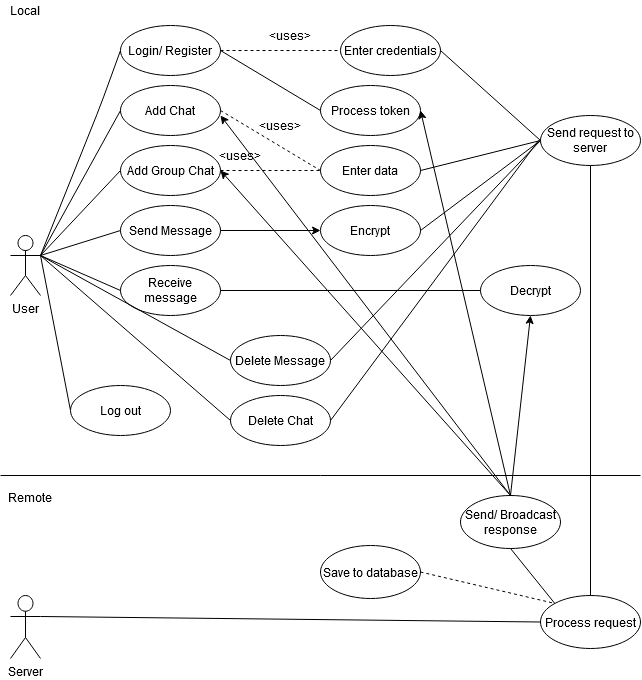

- [Presentation](#presentation)
- [Abstract](#abstract)
- [Introduction](#introduction)
  - [The application](#the-application)
- [Introduction](#introduction-1)
  - [The application](#the-application-1)
- [Theoretical Aspects](#theoretical-aspects)
  - [Symmetric key encryption](#symmetric-key-encryption)
  - [Public key encryption](#public-key-encryption)
  - [Attacks](#attacks)
  - [Authentication](#authentication)
    - [Message authentication codes](#message-authentication-codes)
    - [PRFs](#prfs)
    - [HMAC](#hmac)
    - [Authenticated encryption](#authenticated-encryption)
    - [Authenticated encryption with associated data](#authenticated-encryption-with-associated-data)
  - [Digital signatures](#digital-signatures)
  - [End to end encryption](#end-to-end-encryption)
    - [Drawbacks](#drawbacks)
      - [Metadata](#metadata)
      - [Man-in-the-middle attacks](#man-in-the-middle-attacks)
      - [Endpoint security](#endpoint-security)
      - [Backdoors](#backdoors)
  - [AES](#aes)
  - [Classical Diffie Hellamn](#classical-diffie-hellamn)
  - [Elliptic curve cryptography](#elliptic-curve-cryptography)
- [Existing Technologies](#existing-technologies)
  - [Signal protocol](#signal-protocol)
    - [Diffie Hellamn](#diffie-hellamn)
    - [Extended Triple Diffie Hellamn](#extended-triple-diffie-hellamn)
    - [Double Ratchet](#double-ratchet)
    - [EdDSA signatures](#eddsa-signatures)
    - [Sealed sender](#sealed-sender)
    - [Whatsapp](#whatsapp)
  - [MTProto](#mtproto)
  - [Signcryption](#signcryption)
    - [iMessage](#imessage)
    - [Security analyses](#security-analyses)
  - [Letter Sealing](#letter-sealing)
  - [Threema](#threema)
  - [Group messaging](#group-messaging)
  - [About MLS?](#about-mls)
    - [MLS](#mls)
- [Technologies used](#technologies-used)
- [The application](#the-application-2)
  - [General flow](#general-flow)
  - [Implementation and code layout](#implementation-and-code-layout)
- [Conclusions](#conclusions)
- [References](#references)
- [Terms and algorithms + other stuff](#terms-and-algorithms--other-stuff)
  - [Message authentication code](#message-authentication-code)
  - [Crypto nonce](#crypto-nonce)
  - [Padding oracle attacks](#padding-oracle-attacks)
  - [Replay attacks](#replay-attacks)
  - [Elliptic curve Diffie Hellman (ECDH)](#elliptic-curve-diffie-hellman-ecdh)
  - [Integrated enc scheme](#integrated-enc-scheme)
  - [Curve25519](#curve25519)
  - [NIST curves](#nist-curves)
  - [AES](#aes-1)
  - [AES GCM](#aes-gcm)
  - [IGE](#ige)
  - [SHA](#sha)
  - [SHA 1](#sha-1)
  - [SHA 2](#sha-2)
  - [OAEP - optimal asym enc padding](#oaep---optimal-asym-enc-padding)
  - [Zero-knowledge proof](#zero-knowledge-proof)
  - [Proof of work](#proof-of-work)
  - [AKE](#ake)
  - [Curve448](#curve448)
  - [Deniable encryption](#deniable-encryption)
  - [Federeation](#federeation)
  - [Fan-out](#fan-out)
  - [Deniable encryption](#deniable-encryption-1)
  - [SPDY](#spdy)
  - [Out of bound verification](#out-of-bound-verification)
  - [IND CCA](#ind-cca)
  - [Other websites](#other-websites)

# Presentation
1. What is e2ee
2. How it works
3. Why would you need this
   1. Privacy
   2. Surveillance
4. Issues with current popular apps + backdoors + current state
    - one of the biggest issues is that these protocols are not rigurously analysed 
    - the most "prolific" in the field is the Signal protocol, which developed a few advanced algorithms
5. Probably the application
   1. overview of the app - what the user can do and show all these 
      1. sign up
      2. log in in another window with another user
      3. add a private chat (enc) and send some messages betwee the two users + attachemnts
      4. add another private chat (unenc) and send messages
      5. same for groups
      6. maybe I manage to add the "third party view" and show everything directly 
      7. tell them how hard life is
      8. that's it, probably show the cool color scheme and that I will make it responsive
   2. talk about the technologies for a few minutes while I show the stuff and how everything works
6. Conclusions

# Abstract

/edit 

End-to-end encryption is intended to prevent data from being read by other parties, i.e. servers, service providers, the government, than the ones directly involved into a conversation. This approach has gained popularity in recent years in instant messaging applications and many of these have developed their own protocol or provided adaptations to an existing one. 

The aim of this thesis is to present a synthesis of the most popular technologies, as well as the previous vulnerabilities present either in the protocols themselves or the applications implementing them. 

[Section 2](#theoretical-aspects) introduces theoretical concepts and algorithms that are fundamental to the protocols. In [Section 3](#existing-technologies), each of the end-to-end encryption protocols, namely Signal, MTProto, Signcryption, Letter Sealing and Threema, are discussed in more depth, along with known vulnerabilities and limitations. Moreover, the problem of end-to-end encrypted groups is analysed.

[Section 4](#technologies-used) and [Section 5](#the-application) contain information about the application and the technologies used in its development. The intent of the application is to show, in a comprehensive way, the benefits and the drawbacks of using end-to-end encrypted messaging applications. Along with the regular features of an instant messaging application, it will provide a "third party view" functionality that shows what information is available to a third party. 

[Section 6](#conclusions) sums up the ideas.

\newpage

# Introduction
[1]: [iMessage]()

[2]: [Whatsapp whitepaper](https://scontent.whatsapp.net/v/t39.8562-34/122249142_469857720642275_2152527586907531259_n.pdf/WA_Security_WhitePaper.pdf?ccb=1-3&_nc_sid=2fbf2a&_nc_ohc=pLKbcESAck8AX95AjA-&_nc_ht=scontent.whatsapp.net&oh=73fbf3d0da3f6cae0b216e22b95cbd8b&oe=6079F899)

[3]: [Messenger Starts Testing End-to-End Encryption with Secret Conversations](https://about.fb.com/news/2016/07/messenger-starts-testing-end-to-end-encryption-with-secret-conversations/)

[4]: [Signal]()

[5]: [Trevor Perrin - The XEdDSA and VXEdDSA Signature Schemes](https://www.signal.org/docs/specifications/xeddsa/xeddsa.pdf), 20.10.2016

[6]: [Trevor Perrin, Moxie Marlinspike - The X3DH Key Agreement Protocol](https://www.signal.org/docs/specifications/x3dh/x3dh.pdf)*, 04.11.2016

[7]: [Trevor Perrin, Moxie Marlinspike - Double Ratchet Algorithm](https://www.signal.org/docs/specifications/doubleratchet/doubleratchet.pdf), 20.11.2016

[8]: [Moxie Marlinspike, Trevor Perrin - The Sesame Algorithm:  Session Management forAsynchronous Message Encryption](https://www.signal.org/docs/specifications/sesame/sesame.pdf), 14.04.2017

[9]https://threema.ch/en/about 

/edit

As online communication gained more popularity, using instant messaging applications has become a standard in our quotidian lives. Therefore, the need for assurance that there is no third party spying on our conversations, either the government, the service provider or an attacker, grew even more, especially in states where free speech is constantly threatened.

End-to-end encryption is used to protect the privacy of the messages sent between two or more participants, as they are in transit or at rest, with the intended recipients being the only ones that can decrypt and read the messages. Thus, the third parties interested in intercepting the data sent are unable to see the actual plaintext and there is no need for the users to put their trust in them. Moreover, the messages' contents are protected against possible data breaches. 

Moreover, compliance with regulations regarding data privacy and security becomes easier for the service providers [?]. 

But the cost of benefits is paid with a number of limitations. An example would be user matadata collection, which can be used for advertising[?]. This issue was tackled by Signal with its Sealed Sender feature[?]. 

Also, backdoors are heavily requested by governments in order to protect the citizens and national security [?] and, therefore, spam and abuse becomes harder to control on end-to-end encrypted platforms. More will be discussed in [Section 2](#theoretical-aspects), along with a brief presentation of the cryptographic concepts used throughout the thesis. 

Messaging apps using end-to-end encryption have been around since 2012, with iPhone's native messaging app iMessage[1] and Threema[9], then Signal[4], developed in 2013. This practice became more popular in 2016, when Whatsapp announced the introduction of end-to-end encryption by default in the application[2] and Facebook Messenger added the "secret chats" feature with similar properties[3]. 

The purpose of this thesis is to create an overview of the end-to-end encryption protocols in popular instant messaging apps and their mechanisms. The topics that will be discussed are their current implementations and innovations in the field, as well as past security issues. The protocols analyzed are Signal, MTProto, Signcryption, Letter Sealing and Threema, in [Section 3](#existing-technologies). 

## The application
The application is a web-based instant messaging application which provides end-to-end encryption, by default, for both private and group chats. It supports sending text messages and attachments. 

In order to illustrate the risks of not using end-to-end encrypted applications, the user can initiate unencrypted chats with other users. To have a better view of the implications of this, the user can choose to see through a "third party's view". This will show what a third party can see, including metadata and the messages (encrypted or unencrypted, depending on the user's choice). 

The implementation and the used frameworks and libraries are discussed at large in [Section 4](#technologies-used) and [Section 5](#the-application).


\newpage


- The list includes iMessage, Signal, Whatsapp, Facebook Messenger, Telegram, Threema, to name a few, and the protocols used by these will be analysed in this paper. 
- This proccess involves public key encryption to share a secret between the users, a key exchange algorithm to safely exchange the keys and a symmetric key encryption algorithm that encrypts and decrypts the messages. 
- This paper presents an overview of the security issues raised over the years based on the choices of cryptographic algorithms in some of the aforementioned popular chat applications that have switched to end-to-end encryption.
- Another issue is the user metadata. The messages may be encrypted and unintelligible for a third party, but the fact that two users have communicated at a given time might be enough in case of citizen surveillance. 
- The state of group messaging will be also addressed. This type of communication gets more complex since the algorithms need to keep track of each user involved and having more members becomes cumbersome in certain cases. 


# Introduction
- what is this about? - end to end encryption in messaging apps
- why do we need this/ why is this important? - protect the privacy of the messages that you are sending and receiving from possible eavesdroppers on the line
- how did this evolve during the time? - from normal sms with no encryption (not even in transit) to strong encryption and everything else
- what do I want to achieve with this paper and the application? 

---

- as online communication gained more popularity, using instant messaging applications has become a standard in our quotidian lives
- therefore, the need for assurance that there is no third party spying on our conversations, either the government, the service provider or a person with malicious intent, grew even more, especially in states where free speech is threatened
- end-to-end encryption is used to protect the privacy of the messages sent between two or more participants, in transit or at rest, with the intendend recipients being the only ones that can decrypt and read the messages
- thus, the third parties interested in intercepting the information sent are unable to see the actual plaintext
- messaging apps using end-to-end encryption have been around since 2012, starting with iPhone's native messaging app iMessage[1] and then Signal[4], previously known as TextSecure and then RedPhone, developed in 2013
- but this practice became more popular starting from 2016, after Whatsapp announced that the users' messages will now be end-to-end encrypted by default for all of their chats, and with Facebook's testing of secret chats in the messaging application, in the same year[3]
- both are using the Signal protocol in the background, which came with a few novelties in the field, such as the Double Ratchet Algorithm[5]
- various other apps became more popular in the past years after they received endorsement from different public figures (Snowden, Elon[9] - Signal, Telegram - ??), or are used in certain crountries (Line - mostly Asian user base)
- some of these are implementing their own encryption schemes and protocols, but they are mostly relying on Elliptic Curve cryptography, especially the Curve25519 variant of the Diffie-Hellman key exchange and SHA 256 for hashing ++
- a more in depth analysis of the protocols used by some popular applications will be discussed in [Section 3](#3-existing-technologies), as well as their security issues or proposed improvements
- the main cryptographic concepts on which these are based will be briefly presented in [Section 2](#2-theoretical-aspects), details added accordingly for each protocol extending them

- the underlying encryption scemes implemented by the protocols are as follows:
- signal uses x3dh, extended version of ecdh, along with the double ratchet algorithm
- as signature scheme, the eddsa tries to combine the curves (signal/ xesda)
- imessage comes up with a type of signcryption, sign then encrypt method, trying to optimize the two processes
- telegram's mtproto 2.0 uses ecdh  for key generation, sha 256 as hashing function and aes for encryption


## The application

- the app is a web-based instant messaging application which provides end-to-end encryption for both private and group chats
- in order to illustrate the risks of using chat applications without end-to-end encryption, the user can switch between the encrypted and non-encrypted versions
- the implementation and the used frameworks and libraries are discussed at large in [Section 4](#4-technologies-used) and [Section 5](#5-the-application)


References

[1]: source for the first time iMessage got the encryption

[2]: [Whatsapp whitepaper](https://scontent.whatsapp.net/v/t39.8562-34/122249142_469857720642275_2152527586907531259_n.pdf/WA_Security_WhitePaper.pdf?ccb=1-3&_nc_sid=2fbf2a&_nc_ohc=pLKbcESAck8AX95AjA-&_nc_ht=scontent.whatsapp.net&oh=73fbf3d0da3f6cae0b216e22b95cbd8b&oe=6079F899)

[3]: [Messenger Starts Testing End-to-End Encryption with Secret Conversations](https://about.fb.com/news/2016/07/messenger-starts-testing-end-to-end-encryption-with-secret-conversations/)

[4]: something about the Signal protocol and when did it appear

[5]: Trevor Perrin - *[The XEdDSA and VXEdDSA Signature Schemes](https://www.signal.org/docs/specifications/xeddsa/xeddsa.pdf)*, 20.10.2016

[6]: Trevor Perrin, Moxie Marlinspike - *[The X3DH Key Agreement Protocol](https://www.signal.org/docs/specifications/x3dh/x3dh.pdf)*, 04.11.2016

[7]: Trevor Perrin, Moxie Marlinspike - *[Double Ratchet Algorithm](https://www.signal.org/docs/specifications/doubleratchet/doubleratchet.pdf)*, 20.11.2016

[8]: Moxie Marlinspike, Trevor Perrin - *[The Sesame Algorithm:  Session Management forAsynchronous Message Encryption](https://www.signal.org/docs/specifications/sesame/sesame.pdf)*, 14.04.2017

[9]: *[Elon Musk, endorsing Signal @ Twitter](https://twitter.com/elonmusk/status/1347165127036977153)*

# Theoretical Aspects
- [might be useful for this section](https://cryptobook.nakov.com/)


In this chapter, I will briefly present some of the main concepts that will be used throughout the thesis. 


## Symmetric key encryption
- HOAC 33
- https://en.wikipedia.org/wiki/Symmetric-key_algorithm
- https://resources.infosecinstitute.com/topic/padding-oracle-attack-2/


Symmetric-key encryption is an encryption scheme which uses the same key for both encryption and decryption. In this case, the key must be a shared secret between the communicating parties, which might result in security issues if the key is intercepted, if it is sent through an insecure channel. 

An advantage of this type of algorithms is that they are more efficient in terms of software and hardware. 

- /e image

A widely used symmetric cipher in end-to-end encryption protocols is AES (Advanced Encryption Standard).

---

One such cryptographic algorithm that is popular in end-to-end encryption protocols is AES (Advanced Encryption Standard).


## Public key encryption
- HOAC 43, 301
- https://en.wikipedia.org/wiki/Public-key_cryptography
- https://resources.infosecinstitute.com/topic/padding-oracle-attack-2/
- enc function - trapdoor function with the nec info being the decryption key

Public-key encryption, or asymmetric encryption, is an encryption scheme which uses a public and a private key pair for each user. The public key is known and can be publicly distributed, so sending it through an insecure channel is not an issue anymore, but the private key must be kept secret by the user. To encrypt a message, the sender uses the public key of the receiver, which can be decrypted only using the recipient's private key. 

The security of this encryption scheme resides on the property of the key pair that, while knowing the encryption key, it must be computationally infeasible to obtain the plaintext message from a random ciphertext, so obtaining the decryption key.

A drawback of public key encryption is that it is less efficient than symmetric key encryption but it can be used as a secure channel for key exchange or for encrypting smaller data sets. 


---

Examples of asymmmetric key algorithms, commonly used in popular end-to-end protocols, are the Diffie-Hellman key echange protocol and Elliptic curve based cryptography.


## Attacks
- https://www.tutorialspoint.com/cryptography/attacks_on_cryptosystems.htm
- https://www.ics.uci.edu/~stasio/ics8-w12/Week9%20-%20part%202%20-%20Symmetric%20Key%20Encryption.pdf
- https://www.cs.clemson.edu/course/cpsc424/material/Cryptography/Attacks%20on%20Symmetric%20Key.pdf


There are various attack vectors that can be identified on cryptosystems. Their aim is to obtain the private key based on information that can be collected from plaintext or ciphertext, usually. Some of them are briefly presented below. Also, vulnerabilities to some of these have been present in the protocols that will be analyzed further. 

The **ciphertext only attack** involves an attacker who has access to the ciphertexts and can is successful when the plaintext can be obtained from a set of ciphertexts. The encryption key can be determined afterwards.

Modern cryptosystems are not affected by this type of attack anymore.

In the **known plaintext attack**, the attacker knows the plaintext and corresponding ciphertext ant its aim is to obtain the key. This type of attack works on simple ciphers. 


**Side channel attacks** are more concerned on the way the computer system is implemented, not on the implementation of the algorithm itself. Usually physical, the information that can be used against a cryptosystem consists of power usage, the amount of time the process takes, sounds or electromagnetic radiation leaks.


**Impersonation**

An adversary can place themselves in the communication between two parties, A and B, and send their public key such that A thinks it was B's public key. In this way, the adversary can decrypt the message, read and/ or alter it before encrypting it with B's key and sending it forward. 

This kind of attack can be mitigated using authentication, so guaranteeing that the recipient is the intended one. 

**Chosen plaintext attack**
- [wiki](https://en.wikipedia.org/wiki/Chosen-plaintext_attack)
- [wiki, semantic security](https://en.wikipedia.org/wiki/Semantic_security)

The adversary chooses arbitrary plaintext and then is given the corresponding ciphertext. The intention is to reduce the security of the encryption scheme. 

This attack can be classified further into batch attacks and adaptive attacks. In case of a batch chosen plaintext attack, the adversary knows the plaintext before seeing the corresponding ciphertext, while in the adaptive chosen ciphertext attack, the attacker can request more ciphertexts after seeing the ciphertext of corresponding plaintext. /x

This vulnerability can be fixed by providing semantic security, meaning that the adversary should not be able to derive anything but negligible information about a plaintext message, given the ciphertext and the public key. This property is also called indistiguishability under chosen plaintext attack. 

**Chosen ciphertext attack**
- [wiki](https://en.wikipedia.org/wiki/Chosen-ciphertext_attack)

In this type of attacks, the adversary has access to the decryptions of chosen ciphertexts and the intention is to obtain the privete key. 

It can be split in two categories, too: indifferent or "lunchtime" attack and adaptive attack. 
The lunchtime attack refers to the fact the the attacker can receive decryptions of any chosen ciphertext until a certain point. The term comes from the fact that the attacker has access to the user's device that can decrypt these ciphertexts, which was left unattended. 
In adaptive chosen ciphertext attacks, the adversary is only allowed to choose ciphertexts related to the target one and obtain enough information to decrypt it. 

To avoid such attacks, the cryptosystem should not provide any decryption oracles, for example.

**Brute force attacks** are the slowest ones. They are done by trying all the possible keys until the message is decrypted, hence the decryption key is obtained. 


## Authentication
- intro - hoac 42 [1]
- identification and entity auth - hoac 401 [2]
- contemporary crypto/ 318 [3]
- https://en.wikipedia.org/wiki/Authentication

Authentication is the process of proving the identity of an entity, called claimant, to a verifier and preventing impersonations. It might be done using certain credentials (a password) or with a digital certificate (in case of websites). 

The process of entity authentication finishes with acceptance or rejection. Therefore, for three distinct parties, A, B honest and and a third party C, the following objectives can be defined: [2]

- if A successfully authenticates to B, then B accepts the identity of A
- after a successful identity exchange between B and A, B cannot impersonate A to C
- if C tries to impersonate A, there is a negligible change that B will authenticate A, even after a large number of authentication protocols between C and A and B.

Another form of authentication is data origin authentication or message authentication. These are techniques that assure one party of the identity of the sender. Usually, the message has additional information attached so the receiver can determine it. 

---

According to [3], there are two types of technologies used for messsage authentication:
- digital signatures, based on public key cryptography, where the private key is utilized when generating the digital signature and the public one is the used for verification
- message authentication codes (MACs), using symmetric keys

### Message authentication codes
- Serious crypto pg 179 [1]
- contemporary crypto/ 318 [2]
- ? [MLS](PDF/Papers/20. Evaluation of the MessagingLayer Security Protocol - FULLTEXT01.pdf)

- keyed hashing functions (hashing func with secret keys) => message auth codes (MAC) and pseudorandom func (PRF)

MACs (Message authentication codes) are authentication tags created from the message and the secret key and protect the authenticity and integrity of the message. They use symmetric schemes, so the secret key must be known by both participants because it is also used to verify the MAC and to confirm that a message was not modified in transit. 

They are usually combined with a cipher and, in this way, the message's integrity, authenticity and confidentiality is kept.  


**Attacks**

A MAC is secure when the attacker cannot create a tag for a message when they don't know the key. 
In [2], two types of attack vectors are presented: forgery attacks and replay attacks.

- forgery - create a tag when you don't know the key
- attack vectors:
  - known-message attack - tags and data collected by an eavesdropper
  - chosen message attack - the attacker chooses the messages to be auth and if the attacker is able to adaptively choose other messages and their corresponding MACs, it is an adaptive chosen-message attack
  - replay attacks - capture a message and resent it to the receiver, pretending to be the sender - mitigation by numbering the messages?

- It can be concluded that if the adversary can determine the secret key, the system is totally broken. If the MAC of a meaningful message was determined, then the MAC is selectively forged, and if the message is not meaningful, the MAC is existentially forged. ? rephrase
- A way to lower the possibility of guessing a MAC (which is always possible?) is to increase the tag length and a message authentication system is secure if the attacker can only guess the MAC in order to forge it. 
- Another issue is whether the attacker can verify the guessed MAC and this gives us two new categories: verifiable and non-verifiable MACs.
- Non-verifiable MACs are more secure, since it's not possible to find the correct one using brute-force. 


### PRFs
- pseudorandom functions sc/ 181 [1]
- contemporary crypto/ 327 [2]

Pseudorandom functions turn a message, using a secret key, into a seemingly random output. As defined in [2], a function f, $f:X \rightarrow Y$ is pseudorandom if it is randomly chosen from the set of all mappings from $X$ to $Y$. /x

They are considered stronger because the requirement that the output is indistinguishable from a random string is stronger than the unability to forge tags. [1]


- not meant to be used on their own
- key derivation schemes use this to generate crypto keys from a master key or password 
- ident keys use this to generate a response from a random challenge? - ex a server sends a random challenge message and the recv should prove with this that it knows the key
- tls - prf to generate key material from a master secret and session specific random values


### HMAC
- sc pg 184 [1] attacks and info about cbc-macs/ 186
- https://datatracker.ietf.org/doc/html/rfc2104 [2] + formula

Hash-based MAC is a MAC which is obtained from a hash function, function that produces a fixed-size hash value out of random-sized data and they should be collision free, and are used by the end-to-end encryption protocols that will be analyzed later.
Therefore, to compute it, one needs a cryptographic hash function, a secret key and the message.
Similar to MACs, they are used to prove authenticity and integrity of the messages and their strenght depends on the strenght of the hash function.


### Authenticated encryption
- sc 200
- [wiki](https://en.wikipedia.org/wiki/Authenticated_encryption)
- contemporary crypto/ 451 - entity encryption

Authenticated encryption (AE) is a mix between a cipher and a MAC and it is used to assure data confidentiality and authentication. 

The combinations are different in terms of the order of the encryption and authentication, and the following three ways can be defined. The message is not accepted if the ciphertext or the tag was corrupted.

**Encrypt and MAC**
The ciphertext and the tag are computed separately. The recipient then decrypts the ciphertext and uses it to obtain the tag and compares it to the received tag.  

**MAC then encrypt**
The tag is computed first and it is concatenated to the message, which is encrypted afterwards. The recipient decrypts the ciphertext and computes the tag from the resulting plaintext.

**Encrypt then MAC**
The tag is obtained from th eciphertext and the recipient computes the tag and only if the received and obtained tags are equal, the message is decrypted. 


### Authenticated encryption with associated data
- sc 204, AES GCM/ 208

A version of AE is the authenticated encryption with associated data (AEAD). The authenticated data is processed by an authentication cipher but it is kept in plaintext. This is useful if you need certain data to be available, such as a header, but the payload needs to be encrypted. 

Authentication ciphers use a secret key and a message to obtain the ciphertext and the tag together, making the process faster and more secure than the normal AE. The decryption phase uses the ciphertext and tag along with the key to obtain the plaintext and authenticate the data. 

The output of an AEAD operation is the ciphertext, tag and the unencrypted associated data, obtained from the key, plaintext and same associated data. Thus, the tag depends on both the plaintext and associated data. 
In order to decrypt and verify the message, the key and output parameters are needed. 

Moreover, if the plaintext is empty, the algorithm can be considered a normal MAC. Similarly, if the associated data is missing, it becomes a normal authentication cipher. 


## Digital signatures
- intro - hoac 40
- digital signatures (ch 11) - hoac 441 
- contemporary crypto/ 396
- https://en.wikipedia.org/wiki/Digital_signature
- https://blog.pandadoc.com/what-is-a-digital-signature-and-how-does-it-work/
- https://www.docusign.com/how-it-works/electronic-signature/digital-signature/digital-signature-faq
- https://cybersecurity.att.com/blogs/security-essentials/digital-signatures-101-a-powerful-and-underused-cybersecurity-ally /////


Digital signatures are values that bind the identity of the originating entity to the contents of the message or document. They are used to verify the authenticity and integrity of the messages and to provide non-repudiation, meaning that the signer cannot successfully claim that they did not sign the message.

The digital signature scheme is similar to public key encryption, and consists of the following algorithms:
**Key generation** A public and a private key are generated. The private one is kept secret, while the other one is publicly available.
**Signing process** The signature is produced using the private key of the signer and the message.
**Signature verification process** From the public key of the sender, the message and the signature, the authenticity of the message can be either accepted or rejected. 

They must be correct (the valid signatures must be accepted) and secure (it should be computationally infeasible to forge a signature without knowing the key). Also, it must be computationally infeasible to find a valid signature for a message and a verification key without knowing the signing key. 


---

Digital signatures are equivalent to handwritten signatures and are a means of verifying the authenticity of messages or documents, by providing the entity a way to bind its identity to a piece of information, making it dependent on a secret known by the sender and the content of the message. A valid digital signature is supposed to assure the recipient that the sender is authenticated and that the data was not altered in transit, becoming a way to detect forgery or tampering. /x

They must be verifiable and they can also provide non-repudiation, which means that the signer cannot successfully claim that they did not sign the message. Therefore, the digital signature must be correct (the valid signatures must be accepted) and secure (it should be computationally infeasible to forge a signature without knowing the key). 

---

**Attacks**
- cc/397 [1]

There are two major attack vectors that are taken into account regarding the security of a digital signature:

- key-only attack, when the attacker knows the signatory's verification key but has no information about the signed messages
- message attack, when the attacker knows both the signatory's verification key and some information about the messages or is able to obtain it

The second category can be further split into the following attacks:
- known message attack, when a certain number of unchosen messages and their corresponding signatures are known
- generic chosen message attack, the signatory's key knowledge is independent of the attacker's choice of messages (along with their corresponding digital signatures); the messages must be chosen a priori
- directed chosen message - similar to the previous attack vector but this one is directed against a signatory's key
- adaptive chosen message - the attacker can obtain the digital signatures of a chosen list of messages and it depends on the signing key; the list of messages can be adaptively chosen during the attack (the attacker has access to the signature generation oracle => for every message, the attacker returns a valid signature)


- maybe about the security breaks?
  - total break - determine the key
  - universal forgery - find similar signature algo
  - selective forgery - forge digital signature for a particular message, chosen before
  - existential forgery - forge digital signature for at least one random and not necessarily meaningful message


## End to end encryption
- [Wiki](https://en.wikipedia.org/wiki/End-to-end_encryption)
- [Protonmail e2ee](https://protonmail.com/blog/what-is-end-to-end-encryption/) ??
- [Encryption in-transit and Encryption at-rest – Definitions and Best Practices](https://www.ryadel.com/en/data-encryption-in-transit-at-rest-definitions-best-practices-tutorial-guide/)
- [Data Protection: Data In transit vs. Data At Rest](https://digitalguardian.com/blog/data-protection-data-in-transit-vs-data-at-rest)
- [Brief presentation about ee2e](https://www.youtube.com/watch?v=jkV1KEJGKRA)
- [What end-to-end encryption is, and why you need it](https://www.kaspersky.com/blog/what-is-end-to-end-encryption/37011/)
- [What is End-to-End Encryption?](https://standardnotes.org/knowledge/2/what-is-end-to-end-encryption)
- [end-to-end encryption (E2EE) ](https://searchsecurity.techtarget.com/definition/end-to-end-encryption-E2EE)
- [A Deep Dive on End-to-End Encryption: How Do Public Key Encryption Systems Work?](https://ssd.eff.org/en/module/deep-dive-end-end-encryption-how-do-public-key-encryption-systems-work)
- [WhatsApp, Signal and End-To-End Encryption](https://fcivaner.medium.com/messaging-open-source-and-end-to-end-encryption-41a0252541bb)
- [using quantum key distribution](https://www.ijtsrd.com/papers/ijtsrd18723.pdf)
- [efficient](https://www.delltechnologies.com/en-us/collaterals/unauth/white-papers/products/storage/h18483-dell-emc-powermax-end-to-end-efficient-encryption.pdf)
- https://www.theitstuff.com/what-is-end-to-end-encryption - algo

- https://infosec-handbook.eu/blog/limits-e2ee/ to read

End-to-end encryption is a communication channel in which the messages can be read only by those participating in the conversation and is allowing them to securely communicate through an unsecured channel. 

The general algorithm is based on public key cryptography. The data is encrypted by the sender, at the endpoint, using the public key of the receiver and the only way to decrypt it is by using the recipient’s private key. This ensures that the data cannot be read or modified by any third party involved, since they don’t have access to the private keys. 

The need for this method arises from the fact that many messaging applications use third parties to store the data and it is protected only "in transit" (ex: TLS), meaning that it can be decrypted and read and/ or tampered with before redirecting it to the recipient, when it reaches the server. Therefore, the privacy of data and the user is put at risk, since the contents can be used and interpreted by anyone with access to the server.


### Drawbacks

#### Metadata
[1] https://www.whatsapp.com/legal/updates/privacy-policy/?lang=en
[2] https://www.bbc.com/news/technology-55634139
[3] https://www.androidauthority.com/whatsapp-privacy-change-delay-1223909/ - to read

An important drawback of end-to-end encryption is that metadata about the users or messages can be collected and it is accessible to the server. This information includes the time at which the user is online and for how long, when the message was sent, to whom, information about the device and so on. This data can be used to track the users' activity or be sold to advertising companies. 

An example of the impact of metadata collection is Whatsapp's update of terms and services[1] in 2020. They announced that information regarding the location, browser information, device hardware and connection etc. is automatically collected. This resulted in a shift of the users to other applications considered more secure, like Signal and Telegram. [2]

Some apps have implemented ways to collect as litle metadata as possible. These will be addressed later, in [Section 3](#3-existing-technologies). 


#### Man-in-the-middle attacks

In this type of attacks, the attacker is needs to inject themselves between two endpoints and to impersonate one or more of the participants. The sender will unknowingly use the public key of the attacker who can now read or alter the messages before they are forwarded to the original recipient. 

This can be avoided if the participants' identities are verified. Some applications provide authentication via QR code scanning or using safety numbers. 


#### Endpoint security

The messages are only protected from possible eavesdroppers on the communication channel or while the data is at rest, but the endpoints are still vulnerable. After decryption, the messages in plaintext are available to anyone who has access to the endpoint device, so they can be accessed using other methods (ex. device theft, social engineering, hacking the device). 


#### Backdoors

[1] https://www.justice.gov/opa/pr/international-statement-end-end-encryption-and-public-safety
[2] https://www.politico.eu/wp-content/uploads/2020/09/SKM_C45820090717470-1_new.pdf
[3] https://data.consilium.europa.eu/doc/document/ST-12863-2020-INIT/en/pdf
[4] https://www.boxcryptor.com/en/blog/post/e2ee-weakening-eu/?utm_medium=post&utm_source=newsletter&utm_campaign=en.newsletter.b2bb2c.awareness.politics&utm_content=e2ee.weakening

The service providers might include, intentionally or not, ways to access the data by bypassing the encryption. These are called backdoors and have been highly requested by governments across the years. These weaknesses are mostly needed in order to protect public safety and to "protect citizens by investigating and prosecuting crime and safeguarding the vulnerable" [1].

---

An example might be iMessage's iCloud backup function, but needs research 
https://news.ycombinator.com/item?id=25078034
https://news.ycombinator.com/item?id=25078246
https://www.iphoneincanada.ca/news/imessage-security-flaw/

https://www.cbsnews.com/news/paris-attacks-encrypted-messages-does-the-government-need-a-way-in/


## AES
- contemporary crypto/ 282
- NIST paper
- diagrams for the algo https://proprivacy.com/guides/aes-encryption
- https://techjury.net/blog/what-is-aes/
- https://cr.yp.to/antiforgery/cachetiming-20050414.pdf


AES (Advanced Encryption Standard) is a symmetric block cipher, based on a substitution-permutation network, which uses keys of length 128, 192 or 256 bits to process data in blocks of 128 bits, introduced by NIST in 2001. It was approved by the NSA and is widely used in modern applications, due to its efficiency and security. 

Cache timing side channel attacks are possible. 

**Modus operandi**

- cc/ 296
- https://www.cryptosys.net/pki/manpki/pki_aesgcmauthencryption.html

The following modes of operation are refered throughout the thesis: 

**EBC** (Electronic Code book Mode) in which the plaintext is split into n-bit blocks which are encrypted. A padding is added if the block is shorter than the specified size. The same key is used for the same block, resulting in the same ciphertext. 

**CBC** (Cipherblock Chaining Mode) makes encryption dependant on the key and, previous message blocks and an initialization vector, so the identical plaintext blocks are mapped to different ciphetext blocks. With the initialization vector, the ciphertext is one block longer and if an error occurs in one block (such as transmission errors), it will be propagated to the others. 

**GCM** (Galois/ Counter mode) provides authenticated encryption and and authentication and integrity of the additional data. Takes as parameters the same as the CBC mode, the key, plaintext and and initialization vector and additional data as well. It returns the ciphertext and a MAC. 

**IGE** (Inifinite Garble Mode) has the property of propagating the errors forward indefinitely. 

---

**About the algorithm**

The operations are performed on a State array, which is a two-dimensional array of bytes, having the block length div by 32, Nb (Nb = 128 / 32 = 4) rows and columns and the cells contain 1 byte of the block
In the beginning, the input bytes are copied into the State and after the encryption/ decryption, the output bytes are copied again in the State, row by row (figure at pg 285)

- the key length is computed in the same way, so it would have length Nk 4, 6, 8, depending on number of columns in the cipher key (from 128, 192, 256 bits)
- the state array can be interpreted as a state array of 32 bit words
- operations over a finite field
  - addition - xor
  - multiplication - multiplication of the polynomials mod irreducible polynomial $x^8 + x^4 + x^3 + x + 1$ 
- round keys are values derived from the cipher key and are applied to the state
- these values are fixed: Nr = 10, Nk = 4; Nr = 12, Nk = 6; Nr = 14, Nk = 8
- the round function is composed of:
  - byte subst using a subst table (S-box)
  - shift the rows of the state by different offsets
  - mix data in each column
  - add round key to state
- after an initial round key addition, the round function is implemented Nr - 1 times
- the inverse cipher (decryption) is following the previous steps but in reverse order

- algo + sbox/ 287 and so on with the rest of the operations

**Modus operandi**
- won't write too much about these, maybe just the CTR mode
- 296
- electronic code book mode (ebc)
  - plaintext m is split into t n-bit blocks and a pdding is added if there are not enough bits and encrypted
  - prb: same ciphertext blocks everytime, same key, same message; no protection
- cipherblock chaining mode (cbc)
  - encr depends on the key, all prev message blocks and an initialization vector that is public => identical plaintext blocks are mapped to different ciphetext blocks
  - prb: w/ the init vector, the ciphertext is 1 block longer; if an error occurs in one block, the error is propagated (ex transmission errors)
- cipher feedback mode (cfb)
  - turns block cipher into stream cipher by generating a seq of pseudorandom bits from the block cipher that are added mod 2 to the plaintext to produce the ciphertext bits
  - good when you don't need large data transfers
  - prb: performance; error propagation; can't precompute key stream because you need the ciphertext block
- output feedback mode (ofb)
  - similar to cfb
  - no error propagation
  - it is important to change the init vector regularly if you have the same key
- counter mode (ctr)
  - taken from serious crypto/ 111
  - turns a block cipher into a stream cipher
  - enc blocks composed of a counter and a nonce
    - counter - integer that is incremented for each block - unique for each block
    - nonce - number used only once, each message has a unique nonce
  - enc: xor the plaintext and stream (obtained by "enc"? the nonce and the counter)

**Attacks**
- https://www.schneier.com/blog/archives/2009/07/new_attack_on_a.html
- https://www.schneier.com/blog/archives/2009/07/another_new_aes.html
- https://blogs.ntu.edu.sg/science/2021/03/03/finding-keys-to-the-most-secured-encryption-algorithm/
- side channel attacks are possible


[aes]: NIST, [Announcing the ADVANCED ENCRYPTION STANDARD (AES)](https://nvlpubs.nist.gov/nistpubs/FIPS/NIST.FIPS.197.pdf)


## Classical Diffie Hellamn
- serious crypto/ 268 [1]
- https://www.cs.jhu.edu/~rubin/courses/sp03/papers/diffie.hellman.pdf [2]

Diffie Hellamn (1976)[2] is a key agreeent protocol that allows the participants to share a secret between them, with the exchanged information being public. The secret is turned into session keys and used as symmetric keys to encrypt and authenticate data or to be used as a secure channel, during the session[1 pg 273]. 


**The algorithm**

The mathematical function involves a big prime number $p$ and a base number/ generator $g$ as public information, and a number from the $Z_p^*$ set, chosen by each participant, which is kept private. 

To illustrate the algorithm, for two participants we have the numbers $a$ and $b$. Then each of the participants computes $A = g^a (mod) p$, $B = g^b (mod) p$ and makes these computations publicly available. The other participant takes this result and raises it to their private number and this will be the shared secret, so: $(g^a mod p)^b = (g^b (mod) p)^a = g^ab (mod) p$.

**Security**

The security of the Diffie Hellman protocol resides on the discrete logarithmic problem, which means that you need to recover $a$ from $g^a (mod) p$; this is possible for smaller values, but it is infeasible if the values are chosen correctly.

The security goals that should be provided by this protocol are mutual authentication, no interference with the key exchange process, resistance to impersionation attacks based on a compromised ling-term key and forward secrecy. 


- attack models, as named and defined in [1 / 275]
  - the eavesdropper - attacker observers the message exchange and can record, modify, drop, inject messages; to protect against, the protocol should not leak info
  - the data leak - the attacker has access to some of the session keys and temp secrets (from one or more exec of the protocol), but not the long term secrets
  - the breach - the attacker knows the long term key of one or more parties
- security goals
  - authentication - auth key agreement - both parties auth
  - key control - 
  - *forward secrecy* - if the session is compromised, the keys used in the past cannot be compromised
  - resistance to key-compromise impersonation - happens when the long-term key is compromised


- *backward secrecy* - if a session is compromised, the following communication is not compromised if at least one uncompromised message is sent between the parties


extra - non-dh key exchange: 3g and 4g communications with sim cards


## Elliptic curve cryptography
- serious crypto/ pg 288 [1]
- the presentation saved somewhere [2]
- https://scholar.rose-hulman.edu/cgi/viewcontent.cgi?article=1101&context=rhumj [3]
- https://www.iacr.org/cryptodb/archive/2006/PKC/3351/3351.pdf [4]
- https://datatracker.ietf.org/doc/html/rfc7748 [5]
- https://datatracker.ietf.org/doc/html/rfc8031

- /e needed 

It represents a public-key cryptosystem with its security based on the Elliptic Curve Discrete Logarithm Problem (ECDLP). 
It is more powerful and efficient than classical Diffie-Hellman or RSA and uses keys of smaller sizes (256 bits). 

**Elliptic curves** are curves that are also groups and their law can be constructed geometrically and are horizontally symmetric. They are given by equations in the simplfied form $y^2 = x^3 + ax + b$ (Weierstrass curve) and the coefficients define the shape of the curve. 

They can also be defined over finite fields with addition and multiplication as operations. 

Addition is done by fixing the two points on the curve and draw a line through them until it intersects the curve again. The sum of the two points is the reflection of the second/ third point. 

If the points are the same, draw the tangent through that point until it intersects the curve again and the result is still the reflected point

Multiplication consists of adding the point multiple times to itself. (Optimization - double and add method)


**ECDH key exchange protocol**

The Elliptic Curve Diffie-Hellman protocol is similar to the classical Diffie-Hellman protocol and is also used to exchange a shared secret. 

The public variables are the base point $P$ and the elliptic curve over a finite field $E(F_q)$. The participants need to choose a random integer $k_a$ and $k_b$, which are their private keys and compute $A = k_a * P$ and $B = k_b * P$ respectively. They then exchange the results, $A$ and $B$, and the shared secret is $k_a * k_b * P = k_a (k_b * P) = k_b (k_a * P)$.

Two commonly used curves, which are considered secure and fast, are **Curve25519** and **Curve448** [5]. They are Montgomery curves and their equations are of the form $y^2 = x^3 + ax^2 + x$, where $a = 486662$ for Curve25519 and $a = 156326$ for Curve448. When used in ECDH protocol, the functions using the curves are reffered to as X25519 and X448. 


**ECDSA** 

The Elliptic Curve Digital Signature Algorithm is a digital signature scheme based on ECC and it relies on the ECDLP as well.  


**Security**

- [details here + DH + ECC](./pdf/mit) [2]
- https://ocw.mit.edu/courses/mathematics/18-704-seminar-in-algebra-and-number-theory-rational-points-on-elliptic-curves-fall-2004/projects/asarina.pdf[1]
- course [3]

The security relies of this algorithm on elliptic curve discrete logarithm problem. Instead of obtaining the power $a$ from $g^a$, one needs to find a $k$, if exists, such that $kP = Q$, where $P$, $Q$ are points on the elliptic curve over a finite field $F_q, q = p^n$, $p$ prime.

Usually, the methods for solving this problem are slow, but there are certain types of curves that are vulnerable. 

Attack models [2], [3] /x

- pollard's rho method
- baby step, giant step method - general
- MOV method - for elliptic curves over finite fields described as F^x _q^m, when m is small
- index calculus method


\newpage


# Existing Technologies
- about the technologies used in some of the popular end-to-end encrypted apps and a brief description of how they work


## Signal protocol
- [Signal protocol - wiki](https://en.wikipedia.org/wiki/Signal_Protocol)
- [Signal docs](https://signal.org/docs/) 
- x3dh https://signal.org/docs/specifications/x3dh/ [1]
- double ratchet https://signal.org/docs/specifications/doubleratchet/ [2]
- xeddsa https://signal.org/docs/specifications/xeddsa/ [3]
- OTR https://otr.cypherpunks.ca/ [4] - not really referenced
- v1? https://www.signal.org/blog/asynchronous-security/ [5]
- v2 https://www.signal.org/blog/advanced-ratcheting/ [6]
- axolotl https://web.archive.org/web/20140907055327/https://github.com/trevp/axolotl/wiki [7]
- v3 https://www.signal.org/blog/just-signal/ [8]
- wapp https://www.signal.org/blog/whatsapp/ [9]
- wapp 2 https://www.signal.org/blog/whatsapp-complete/ [10]
- fb https://www.signal.org/blog/facebook-messenger/ [11] - use this for the introduction


---

Pros: double ratchet algorithm, sealed sender feature, improvements on cryptographic primitives. 


The Signal protocol is one of the leading end-to-end encryption protocols at the moment. The applications using this protocol are Signal, Whatsapp, Facebook Messenger (Secret chats), Skype (Private conversations) and Wire. 

Initialy implemented in 2013 for TextSecure, the predecessor of the Signal app, it was developed by Open Whisper Systems, they have improved the Off The Record Messaging (OTR) cryptographic protocol in order to offer both asynchronicity and forward secrecy[5]. The asynchronous behaviour was achieved by sending a set of previously generated keys, called prekeys, which could be then accessed by the users, making the key exchange more efficient.

OTR uses ephemeral key exchanges to offer perfect forward secrecy and this is achieved by a new Diffie-Hellman key exchange for each message. This property assures the user that, if the private keys are compromised, the previous messages cannot be decrypted by an adversary. The static public keys then take the role of authenticating the users. 

The second version, in 2014, added new improvements to the ratcheting algorithm by using the SCIMP's way of obtaining the message key by hashing the last message, therefore obtaining chains of keys. [6] It was initially called Axolotl Ratchet [7], but it was later renamed to Double Ratchet algorithm. 

A third version rolled out in 2016 and they renamed the application to Signal [8]. In the same year, the interest of using end-to-end encrypted applications increased after Whatsapp announced that they are now supporting the Signal protocol. [9?][10]


- combines 
  - double ratchet algo
  - prekey bundle
  - x3dh handshake
- uses
  - Curve25519
  - AES-256
  - HMAC-SHA256

- [20. Cohn-Gordon2020_Article_AFormalSecurityAnalysisOfTheSi](./PDF/Papers/Signal/20.%20Cohn-Gordon2020_Article_AFormalSecurityAnalysisOfTheSi.pdf) - for security analysis too
- [20. Signal Protocol - Makalah-Kripto-2020-06.pdf](./Pdf/papers/signal/20.%20Signal%20Protocol%20-%20Makalah-Kripto-2020-06.pdf)*
- ratcheting, forward secrecy
- X3DH


- 3 stages:
	- initial key exchange with X3DH - long term, mid term and ephemeral DH keys to produce a shared secret root value
	- async ratchet - users alternate in sending the new ephemeral keys with prev generated root keys to generate forward secret chaining keys
	- sym ratchet - use key derivation functions to ratchet forward chaining keys to create sym enc keys
- => each message is encrypted with a new message key
- the ping pong pattern of new epehemaral keys inject auto entropy
- TextSecure - used Double ratche, called Axolotl ratchet at that time => RedPhone => Signal
- over 10 diff types of keys and a chain of updated keys

- async transmission protocol which requires pre-send batches of ephemeral public keys
- when a sender wants to send the messages, they get the keys and performs an AKE like protocol using the long term and ephemeral keys tp compute the message encryption key 
- the message keys depend on previous computations of the keys


- registration - users register their identity w/ a key distribution server and upload the long, mid term and eph keys
- session setup - get the public keys of the recv and establish initial enc keys (x3dh)
- sync messaging (asym ratchet updates) - sender exchanges their public keys with the recv and generate a shared secret => start chains of message keys, fresh ephemeral keys
- async messaging (sym ratchet) - a new sym message key is derived from the previous state, if no new message was sent by the recv, keys derived from the previous ephemeral dh public key of the sender


- the following are present there *
- uses X25519 or X448 ECDH
- key derivation functions: HMAC SHA256, HKDF SHA256
- AEAD - encrypt then MAC scheme: AES256 in CBC, PKCS#5 padding, MAC is HMAC sha 256
- xeddsa signature scheme - x25519 or x448
- the rest is highlighted in the other version of the paper


### Diffie Hellamn
- https://www.cs.jhu.edu/~rubin/courses/sp03/papers/diffie.hellman.pdf
- [Diffie-Helman key exchange (colors)](https://www.youtube.com/watch?v=NmM9HA2MQGI)
- [Diffie-Helman key exchange (maths)](https://www.youtube.com/watch?v=Yjrfm_oRO0w)
- [How Signal Instant Messaging Protocol Works - more explanations](https://www.youtube.com/watch?v=DXv1boalsDI)
- [How End-to-End encryption Works? - wapp](https://www.youtube.com/watch?v=hwQbPgvEQyw)
- [Double Ratchet Messaging Encryption](https://www.youtube.com/watch?v=9sO2qdTci-s)
- [Key Exchange problems](https://www.youtube.com/watch?v=vsXMMT2CqqE)
- [Elliptic curve](https://www.youtube.com/watch?v=NF1pwjL9-DE)


### Extended Triple Diffie Hellamn
- x3dh https://signal.org/docs/specifications/x3dh/ [1]


Extended Triple Diffie-Hellamn is the key exchange protocol used by Signal and provides forward secrecy and deniability. It was designed for asynchronous communications, so the users need to provide some information to the server so that the others can establish the secret key without both being online. 

The algorithm needs an elliptic curve, either X25519 or X448, a hash function, SHA 256 or SHA 512, the information identifying the application and, additionally, an encoding function for the public key. 

Each user has a set of keys based on the chosen elliptic curve: /x??

- long-term identity key - each party has one and they are public
- ephemeral key pair - generated at each run with the public key
- signed prekeys and a set of one-time prekeys - these are sent to the server so that the other party can establish the key exchange
- the shared secret is a 32 byte secret key and is obtained using a HMAC based key derivation function on the Diffie-Hellman shared secret 

+using Montgomery ladder to be more resistant to timing side channel attacks


To prepare the setting, the communication will have 3 parties: the users, A (sender) and B (receiver), and the server. The following three phases are defined [1]: 


**Key publishing**

B publishes to the server his id key and the prekeys. The id key is uploaded once and, in order to keep forward secrecy, the signed prekey and prekey signature are replaced after a time interval and the one-time prekeys are changed after each run. 


**Sending the initial message**

After A gets the prekey bundle from the server and the prekey signature is verified, the ephemeral key pair is generated and it will be deleted when the shared secret is computed. 
If the server doesn't provide an one-time prekey, then three ECDH shared secrets are obtained using the identity keys of the participants, the signed prekey of B and the ephemeral key of A, which are concatenated and passed to a HMAC based key derivation function. The shared secret is the result of this computation. 

If an one-time prekey is present, a ECDH shared key is obtained from it and the ephemeral key of A. The result is concatenated and is passed to a key derivation function. 

The initial message contains A's identity and epehemeral keys, information about B's used prekeys and a ciphertext encrypted with an AEAD encryption scheme. The associated data are the encoded indentity keys of both participants and the secret key is the secret key or the output of the pseudorandom function with SK as key. 

Other additional data can be added, such as identifying information, certificates, usernames etc.


**Receiving the initial message**

B needs to obtain A's identity and ephemeral keys from the message. B then follows the same steps to compute the secret key, creates the associated data sequence using the identity keys and he can decrypt the message using it and the shared secret.

Again, the one-time prekey used for this message is deleted to keep the forward secrecy. 

In both cases, the parties may continue using the same secret key or derivations of it after the exchange 


**Security**

Authentication can be done by comparing the public key fingerprints or by scanning each other's QR codes. This is a common practice for this type of applications and it is a way to prevent MITM attacks. 

If no one-time prekey is provided, the messages can be replayed and accepted by the receiver, therefore the samesecret key can be derived. In order to avoid this type of attacks, the keys must be always randomized or a new encryption key to be negotiated using a new value from the receiver. 

The protocol doesn't offer any proof that the communication between two users took place, unless one of the participants is collaborating with a third party. Then the proof can be obtained. 

The use of prekeys and ephemeral keys reduce the risks of key compromise. 

The parties should not put their trust in the server, because it can refuse message delivering, giving out one-time prekeys or permit draining them by another user. These affect forward secrecy of the shared secret. Also, the server could provide forged keys, therefore, they are not used in the ephemeral keys computations. 

The current authentication scheme does not prevent unknown key share attacks or identity misbinding, but more identification information can be added as associated data. 


### Double Ratchet
- [double ratchet](./pdf/papers/signal/docs/doubleratchet.pdf) [1]


After the shared secret is obtained, the parties are using the Double ratchet algorithm to exchange messages. The new keys are derived and combined with DH values sent along with the messages, so the the messages are protected if the previous or future keys are compromised.  

This algorithm uses KDFs which are then used to form KDF chains. They use as input and output key parts of the output of another KDF. In this way, resilience, forward security and break-in recovery, as stated in [1]. 

Each party has three chains for each session: root, sending and receiving. 


- a new concept, called DH ratchet, is described as follows: the newly exchanged DH secrets, during message exchange, become the input to the root chain and the outputs of the KDF are the keys for the sending and receiving chains  

**Symmetric key ratchet**
- the chains advance with each message sent and received and their unique output keys are used for the encryption and decryption; this is called a  symmetric key ratchet and the unique keys are message keys
- they don't provide break-in recovery because the input ot the KDF is constant and they can be stored unordered or lost messages can be easily handled

**Double Ratchet**
- to prevent previous and future messages compromise, the protocol combines the symmetric key ratchet and the DH ratchet, resulting in the double ratchet algorithm
- a new DH key pair is generated, being the current ratchet key pair; when a new ratchet key pair is received from another party (from the message header), the current one is replaced
- when a new message is sent or received, the symmetric key ratchet step is applied on the corresponding chain (sending or receiving)
- in this way, if one of the private keys is compromised, it will soon be replaced with another one, providing both forward and backward secrecy

- in case the messages are sent out of order or some are lost, the messages header contains the number in the sending chian and the length in the previous sending chain /x, so the receiver will store the message keys for those messsages

- pg 20


### EdDSA signatures
- [xeddsa](./PDF/Signal/xeddsa.pdf)

The signature scheme is defined on twisted Edwards curves. 

- create and verify EdDSA signatures using the key pair defined for X25519 or X448
- this scheme is defined as xeddsa with the extension vxeddsa, which provides a verifiable random function(VRF)
- signatures are defined on [twisted Edwards curves](https://en.wikipedia.org/wiki/Twisted_Edwards_curve) and use the SHA 512 hash function

- the input parameters for the signature algorithm are the (Montgomery) private key mod integer q, the message and 64 bytes of secure random data and for the verification algorithm: the (Montgomery) public key, the message and the signature 

- the signatures are randommized 
- signing time is constant
- it is considered safe to use the same key pair to produce the signatures


### Sealed sender
- [sealed sender](./pdf/papers/signal/18.%20Technology%20preview%20Sealed%20sender%20for%20Signal%20-%20signal-org-blog-sealed-sender-.pdf)


This feature is available in the Signal app and it aims to provide sender anonimity by hiding the identity of the sender from the service provider. This is achieved by including the sender's identity in the message payload so that the receiver can decrypt it and identify the sender. 

To prevent spoofing, the users have a certificate that attests their identity, which are periodically changed. They contain the public identity key and the expiration date. This can be included in messages, so the receivers can check its validity. 

Another issue that needs to be taken into account is abuse. The users derive a delivery token from the profile key and it is registered to the service. If the parties are contacts, then their profiles, end-to-end encrypted, are shared, making the process of sealed sender become easier. 
But the users can enable this for anyone who isn't in their contacts list, so there is no need to check the delivery token. Therefore increasing the risk of spam and abuse. 

The messages are encrypted in a normal fashion, and then they are encrypted again, along with the sender certificate. 


**Groups**

- https://signal.org/blog/private-groups/ - this is from 2014, maybe there is something newer

Group messaging uses pairwise messaging by sending the encrypted message to each member. 

**Security analyses**

- [16 analysis](./pdf/papers/Signal/16.%2019.%20r%20-%20A%20Formal%20Security%20Analysis%20of%20the%20Signal%20Messaging%20Protocol%20-%202016-1013.pdf)
- double ratchet started with TextSecure, which was the app developed before Signal and it combined the ideas from OTR's asymmetric ratchet with a symmetric ratchet; this one didn't include parts from the DH exchange, it only derived a new symmetric key; this was reffered to as Axolotl ratchet

- unknown key share attack (UKS) - is a type of attach where a communication between two honest users is targeted by an adversary at key exchange; one of the users thinks that they shared key with the recipient, but the recipient is unknowingly sharing the key with the attacker; this attack can be mitigated by including both user identities in the key derivation function 
- this type of vulnerability was present in the TextSecure protocol and is not prevented by Signal, since the key derivation is not based on the identities of the users too 

- the paper focuses on the "multi stage AKE protocol" part of Signal

- the paper defines the following threat model:
- the network is fully controlled by the adversary
- the authentication is implicit, meaning that the intended party can compute the key /x
- side channel attacks are not taken into consideration and the out of band verifications of the long and mid term keys is assumed


- [21 sealed sender - improvements](./pdf/papers/signal/21.%20Improving%20Signal’s%20Sealed%20Sender%20-%20ndss21.pdf)

This paper proposes a statistical disclosure attack on the Sealed Sender feature and message timings to create a link between two communicating users. With the help of delivery receipts and the assumptions that the response form the recipeint is immediately send after the message was received, the identity of the sender can be discovered in relatively small number of exchanged messages. 

The proposed solution is to implement a similar scheme, but scaled for conversations. In this way, the identity of the sender is protected during the whole lifespan of the conversation. 


- according to this paper, the anonimity that this feature offers to provide is broken if more messages are sent
- the attack proposed is of the statistical disclosure attack (sda) type and uses the delivery receipts 

- the sealed sender feature hides the identity of the sender from the server or any third party and can be decrypted by the receiver, who will then learn the identity of the sender from the payload
- the identity of he sender is included in the payload to be used later for message authentication
- a delivery token of 96 bit length is derived form the user profile of the sender so the sender proves that they know the receiver -> this is used to prevent spam

- the threat model presented is based on a type of sda, which can be used on message timings, so a link between the sender and the receiver can be made
- this is plausible with the assumption that the response from the receiver is fast; this is facilitated by the usage of delivery receipts 
- the delivery receipts are enabled by default and they tell the sender whether the message was only delivered or it was received by the recipient's device 

- the attack is based on the fact that the sender appears as a recipient in the time period immediately after the initial receiver got the message
- computations and other details at 6-8
- this concludes that the average number of messages exchanged between the two parties would be under 5 to obtain the identity of the sender

- proposal: sealed sender conversations - the initiator of the conversation is not leaked (3 solutions are briefly presented at page 2)
- this improvement would target the whole conversation between two users, not just the messages
- the identity of the receiver can be visible, but the sender's shouldn't be during the whole lifespan of the conversation


**Extra**

- [Statistical deisclosure control](https://en.wikipedia.org/wiki/Statistical_disclosure_control) 
- technique that ensures that ensurea that no persona or organization is identifiable from the results of an analysis of survey or administrative data or in therelease of microdata
- or protect the confidentiality of the respondets and subjs of the research
- related to the statistical disclosure attacks


*Terminology used*

- target - bob, user being monitored
- associate - alice, the user sending msg in the attack window to the target
- non-associate - charlie, not sending msg to the target
- attack window - attack time frame, spanning multiple messages to the target
- target epoch - single epoch during the attack window immediately after a sealed sender msg to the receiver
- random epoch - same len as target epoch, but randomly chosen and ind from bob


### Whatsapp
- [wapp whitepaper](./pdf/papers/signal/WA_Security_WhitePaper.pdf) [1]

Whatsapp implements the Signal protocol for its end-to-end encrypted chats and voice calls. According to the whitepaper [1], the application follows the same protocol and the key pairs are generated over Curve25519. A difference can be seen regarding group chats, where a "server-side fan-out" method is used to send the encrypted messages to the participants. This method uses pairwise encrypted channels and Sender Keys. /x??

To send the first message, the group chat initiator needs to randomly generate a 32 byte chain key and a signature key pair. These are then mixed and create a sender key message and the key is encrypted and sent to each of the participants. 

The rest of the messages are encrypted with AES256 in CBC mode and they are signed afterwards with the signature key and are sent to the server, that will distribute the message to the recievers. The message keys are derived from the chain key. 

The attachments are encrypted with AES256 in CBC mode with a random IV. The MAC is computed using HMAC-SHA 256 and is appended to the ciphertext. The encryption key, HMAC key, hash of the encrypted blob and the pointer to the blob are sent in a normally encrypted message to the recipient, who fetches the keys and the blob and verifies the hash and MAC before it can be decrypted. 


- for the transport layer, [Noise Protocol framework](https://noiseprotocol.org/noise.html) is used, with curve25519, aes gcm, sha 256

- after a session is initialized, the initiator generates a random 32 byte SRTP master secret /x and sends an encrypted message containing it to the recipient

**Analysis**

- [2016-17 analysis](./pdf/papers/signal/WhatsApp%20Security%20Paper%20Analysis%2036.pdf)

This security analysis tackles the problem of MITM attacks after the session was established between two users. Some of the parameters are reused and they are not changed unless an external event takes place, such as app reinstallation or device change or the users have verified each other by scanning their QR code. Therefore, an additional verification step is recommended. 

MITM attacks are a recurring issue but many applications provide QR scanning or fingerprint comparison in order to verify the other users. 


## MTProto
- https://core.telegram.org/mtproto [1]
- https://core.telegram.org/mtproto/description [2]
- https://core.telegram.org/api/end-to-end [3]
- https://core.telegram.org/api/end-to-end/video-calls
- https://www.cybercitadel.com/signal-vs-telegram-a-detailed-comparison-of-security-and-privacy/
- https://telegram.org/evolution [4]
- https://core.telegram.org/api/end-to-end/pfs [5]
- https://core.telegram.org/techfaq#q-do-you-use-ige-ige-is-broken [6]


The MTProto protocol was created in 2013 for the Telegram messaging app. End-to-end encryption is not enabled by default and it is only supported for private chats and this is usually considered a (serious) drawback in app comparison [?]. 

In 2017, the protocol was upgraded from MTProto 1.0 to MTProto 2.0, which uses SHA256, padding when computing the message key and dependance on the authorization key. 

Normal chats, or cloud chats, are only encrypted between the client and the server. For message encryption, AES256 in IGE mode [6] and an IV are used and the key is obtained from a combination between the middle 128 bits of the SHA256 hash of the message, padding, message id etc. and 32 bytes from the authorization key. 

The authorization key is shared by the client and the server using a Diffie-Hellman key exchange. They are 2048 bits long and the server key is a RSA key that is kept on the server and rarely changed. 

The message is then sent along with a header containing the authentication key idetifier and the message key. To keep backward compatibility between the versions, the key identifier is composed of the lower 64 bits of the SHA1 hash of the authorization key. [2] /x

For the secret chats, the message key also depends on the secret chat key. 
The keys are generated and exchanged using the Diffie-Hellman protocol and they are 256 bytes long. To ensure forward secrecy, the users initiate the re-keying protocol after 100 encrypted and decrypted messages or after it was in use for more tha a week and the old keys are deleted. [5]

The messages are encrypted using AES256 in IGE mode and an 256 bit IV, where the encryption key is obtained from the hash of the message key. The message key is the middle bits obtained from parts of the shared secret, plaintext message and some random padding. The encryption key fingerprint and the message key are, also, added over the ciphertext. [3] To decrypt, the steps from creating the ciphertext and keys are taken in reverse order. 

For files, they are encrypted with one-time keys and are save on the server. They are randomly generated 256 bit AES keys and IVs and will be used to encrypted the files using AES256 in IGE mode as well. 

If a client still uses MTProto 1.0, the other client will downgrade to the previous version.


**Security analyses**


- [2015 cca](./pdf/Papers/Telegram/15.%20On%20the%20CCA%20(in)security%20of%20MTProto%20-%202015-1177.pdf) [1]
- [2014 authentication problem](./pdf/papers/telegram/14.%20INT_Telegram_EN.pdf) [2]
- https://www.cryptofails.com/post/70546720222/telegrams-cryptanalysis-contest [3]
- [2017 security analysis on mtproto 1.0](./pdf/papers/Telegram/17.%20Security%20Analysis%20of%20Telegram.pdf) [4]
- [2020 symbolic verification](./pdf/papers/telegram/20.%20Automated%20Symbolic%20Verification%20ofTelegram’s%20MTProto%202.0%20-%202012.03141.pdf) [5]
- https://core.telegram.org/techfaq#q-why-are-you-not-using-x-insert-solution [6]
- https://core.telegram.org/techfaq#q-do-you-use-ige-ige-is-broken [7]


Telegram was actively criticised for using weak or lesser known criptographic primitives in [1], [3], [4] and for having a "home grown" protocol, but they claim that this combinaton provides better "delivery time and stability" [6] or that the primitives are "not broken in their implementation" [7]. In the following, the known and serious vulnerabilities are presented, along with possible mitigations. 

This paper [1] explores two theoretical attacks showing that MTProto is not IND CCA secure and it does not satisfy the properties of authenticated encryption because the length or the content of the padding is not checked for integrity during decryption. /x Therefore, one can create two different ciphertexts that decrypt to the same plaintext.

The first attack is done by adding a random block, larger than the block length, at the end. Since the padding is not included in the authentication funtion nor its size is checked, the message decrypts normally. In this case, a length check is recommended. 

The second one involves subtitition of the last block of the cipher. This attack has significantly lower chances of success, but it is still not secure. To mitigate this, they suggest adding the pading when the MAC is computed. 

The lack of authenticated encryption and general weaknesses in the authentication mechanism are mentioned in [2], [3], [4] also. In [2], the possibility of a MITM attack is illustrated, using an unofficial command line interface for Telegram on Linux. 

The client verifies the server using a fingerprint, which is the first 128 bits of the SHA 1 hash of the server's public key. The MITM could generate a fingerprint with the same first 128 bits, so that the server could not detect the attack. ?> This would work if the victim installs a modified app, but this is helped by the aforementioned weakness.  

These issues were fixed in MTProto 2.0[?], so the protocol is now considered secure against IND CCA [5]. The fingerprint is 288 bits long and the hashing function was changed to SHA256, but a MITM attack is still possible if the users do not verify each other by comparing the fingerprints.

However, [4] pointed out that third parties could observe metadata about the users, such as the moment when they are online or offline, only by having them saved in the contacts list, which is shared with the server. In this way, an observer could guess the moment when two users might be communicating. A feature that disables this was added and is used in other applications too. 

The automatic symbolic verification from 2020 [5] concluded that possible vulnerabilities can arise from insufficient checks and verifications, side-channel attacks or faulty user behaviour. 

It is stated that the messages remain secret after the re-keying proccess, even if the authorization keys where compromised, but if the session key is recovered, the past 100 messages or the ones exchanged in the past two weeks can be decrypted, so the form of forward secrecy employed by the protocol is kept. 

Also, it is suggested that the clients pay attention to the DH parameters sent from the server because they can be generated in a way that makes the DLP feasible. 

---

- [2020 symbolic verification](./pdf/papers/telegram/20.%20Automated%20Symbolic%20Verification%20ofTelegram’s%20MTProto%202.0%20-%202012.03141.pdf)
- code for the client and the protocol itself is open source, but not the servers
- there are not enough security analyses on this protocol and was criticised for the choice of cryptographic primitives and the encryption mode

**Previous issues found**

- these issues were found in version 1.0
- the padding was added after the encryption, so this could lead to chosen ciphertext attacks
- no forward secrecy was provided
- the message sequence numbers were managed by the server, so there was place for reply attacks
- the server could perform a MITM attack on two parties because the Diffie Hellman exchange protocol was used before the participants were authenticated; the first 128 bits of the hash, using SHA 1, were used for the fingerprint and the server could perform a birthday attack to find the keys corresponding to this fingerprint; this was changed in 2.0 and the fingerprint is 288 bits long, containing parts from the SHA 256 key /x

- the current version is considered to guarantee integrity of ciphertext, indistiguishability of chosen ciphertext and forward secrecy, as no attacks of these types are known

**Study findings**

- the study conducted finds that there are no logical flaws in the protocol, and possible vulnerabilities can arise from the cryptographic primiteves used, implementation flaws (not enough checks), side-channel exfiltration (time and traffic analysis) /x or incorrect user behaviour /x
- also, the messages are kept secret after the re-keying process is completed, even if the authorization keys are compromised for both participants before the process
- forward secrecy is also kept but if the attacker recovers the session key, the last 100 messages or the messages in the past week are compromised
- if the parties have correctly validated the initial session keys, then the messages they exchange are authentic; otherwise, MITM attacks are possible, so the participants need to be aware of the correct way in which they perform the procedure
- the server can send out weakened Diffie Hellman parameters such that the discrete logarithms become easier to compute, so the end user need to verify these parameters


- [2017 security analysis on mtproto 1.0](./pdf/papers/Telegram/17.%20Security%20Analysis%20of%20Telegram.pdf)

The study shows that third parties could observe metadata about the users, such as the moment when they are online or offline, only by having them saved in the contacts list, which is shared with the server. In this way, an observer could guess the moment when two users might be communicating. 


- some of these things are deprecated and were fixed for the second version
- the whole study shows that you could use the metadata to "guess" when the communication between two parties takes place
- is considered to provide the best user experience because of its speed and functionality
- the reason they gave for the fact that end-to-end encryption is not enabled by default is that the secret chats are bound to the device and that it is not possible to continue a conversation on devices where this feature is not enabled
- the official clients are open source but have binaries without public codes
- Telegram also provided a CLI lol 
- cloud storage, so the server has access to all unencrypted messages and metadata
- the paper classifies the issues as follows:
  - non-technical concerns
    - end-to-end encryption is not by default
    - the protocol is "home grown"
    - access to the contact list needs to be provided beforehand and the information is stored on the server
  - technical 
    - MITM attacks (2015), by generating Diffie Hellman secrets that provide the same authorization fingerprints with the same 128 bits as the ones of the users, so they can't detect the attack
    - used a modified version of the Diffie Hellman protocol until 2014, where the key was XORed with a nonce, so the attacker could use different nonces and the users would have the same key which would be also known to the server /x
    - SHA 1 instead of SHA 256, which is not collision resistant


## Signcryption
- [Wiki](./PDF/Wiki/Signcryption.pdf) 
- https://link.springer.com/content/pdf/10.1007%2FBFb0052234.pdf [1]
- https://www.iacr.org/archive/eurocrypt2002/23320080/adr.pdf [2]

Pros: reduces encryption + signature cost

This protocol was introduced in 1997 [1] and it combines the features of both digital signature and encryption, in a public key setting. Its aim is to decrease the cost of previously used signature then encrypt schemes and to optimize the procedure. 

The total cost, then, can be considered the sum of costs of each operation and using this combined approach would reduce it with "50% in computational cost and 85% in communication overhead", keeping the security definitions offered by the two operations, namely sending an authenticated and secure message [1].

The protocol would contain two algorithms, namely signcryption and unsigncryption, with the properties:

- unique unsigncryptability - the signcrypted message is recovered using the unsigncryption algorithm
- security - the properties of a secure encryption scheme and secure digital signature are fulfilled: confidentiality, unforgeability, non-repudiation, integrity
- efficiency - as mentioned before, smaller computational cost.


A security analysis of signcryption was conducted in 2002? [2].

- two definitions, depending on the adversary: outsider or insider
- signcryption is defined for the public key setting, being the equivalent of authenticated encryption is in the symmetric encryption
- the paper explores the applicability of this scheme in a setting with two users, but this can be generalized to multiple users
- the scheme needs to fulfill the folowing conditions?:
  - each user should publish their public key 
  - the signcryption needs to contain the identities of the sender and the receiver
  - each user should be protected from the other users /x
- the scheme has three algorithms:
  - generation, which returns the pair of keys: the private sign and decrypt key and the public verification key
  - (randomized) signcryption, which takes as parameters the sender's secret key, the receiver's public key and the message /x
  - (deterministic) designcryption or unsigncryption, takes as parameters the ciphertext, the receiver's secret key and the sender's public key

**Security**

- pg 8
- outsider security - the adv knows the public keys and has access to the signcryption and unsigncryption oracles of the sender and the receiver, so it can do CPAs and CCAs; the scheme is outsider secure (indistiguishable against generalized CCA2) if it is outsider secure against adaptive chosen ciphertext attacks; OR it protects the privacy of the receiver when talking to the sender from outsider intruders who don'r knwo the secret key of the sender
- insider security - the adversary is a user of the system so the sender has access to the secret key of the receiver and for encryption, the receiver has access to the decryption key because it contains the secret key of the sender; the scheme is insider secure against gcca2 or cma attacks on the privacy or authenticity property if the corresponding induced enc/ sign scheme is secure against the attack (IND gCCA2 - enc, UF-CMA - sign); OR one of the parties is the attacker, so the scheme protects the sender's authenticity against the receiver and the receiver's privacy against the sender

- non-repudiation - singcryption only assures the receiver that the mesage was sent by the actual sender
- comparison btw insider and outsider security:
  - is for authentcity implies non-repudiation when the receiver reveals its secret decryption key or by zero-knowledge proof
  - os - th ereceiver can generate valid signcryptions of messages that are not actually send by the sender, so non-repudiation can't be acheived
- os might be enough for privacy and authenticity, but the is can be useful in case the secret key of the sender is stolen and we don't want the attacker to be able to understand previously or future recorder signcryption (some kind of forward and backward secrecy)


**Definitions and notations - EXTRA**

- indistinguishability - given a randomly selected public key, not probabilistic pol time (ppt) adv can distinguish between the encryptions of two chosen messages (by the adversary)
  - based on the def above there are two stages - find and guess
- CPA - chosen plaintext attack - the adv is not given other capabilities but to encrypt the messages with the encryption keu
- CCA1 - lunch time attack, give the adv access to the decryption oracle and they can decrypt chosen ciphertexts
- CCA2 - adaptive chosen ciphertext attack - access to the decryption oracles in the guess stage (def above) and has the restriction that the given ciphertext is different from the actual ciphertext the adv wants to decry[t]
- secure against gCCA2 - generalized CCA2 security and the scheme is secure against this if there is an efficient decryption respecting relation R(e, e') => dec(e) = dec(e')


- UF - existential unforgeability - negligible probabilityof generating a valid signature for a new message
- NMA - no message attack - adversary has the verification key (public)
- CMA - chosem message attack - adversary has access to the signing oracle and query it to obtain valid signatures
- combined: UF-NMA, UF-CMA
- sUF - strong unforgeability - adv should NOT be able to generate a singature for a new message and to generate a diff signature for a signed message -> makes sense for CMA, so you have sUF-CMA


- taken from wiki
- key generation, signcryption, unsigncryption
- properties:
  - correctness
  - efficiency
  - security, **and some signcryption schemes provide public verifiability and foward secrecy, so:**
    - confidentiality
    - unforgeability
    - non-repudiation
    - integrity
    - public verifiability
    - forward secrecy and message confidentiality


### iMessage

- [Official](https://support.apple.com/en-us/HT209110) [1]
- [E2ee official](https://support.apple.com/guide/security/encryption-and-data-protection-overview-sece3bee0835/1/web/1) [2]
- [Security overview](https://support.apple.com/fr-fr/guide/security/secd9764312f/web) [3]
- [How iMessage sends and receives messages securely](https://support.apple.com/fr-fr/guide/security/sec70e68c949/web) [4]


Apple's iMessage chat application and FaceTime use the signcryption protocol in order to support end-to-end encryption for messages, attachments and video calling. [1] These can be automatically deleted after a certain period or backed up in iCloud, where, as they state in the documentation, the data is also kept encrypted. If the device is locked with a password, the local messages are encrypted until it is unlocked. 

Also, the messages that are not sent are kept on the server for 30 days. Along with this, other data that is stored or collected include information about iMessage and FaceTime, device configurations and phone numbers and email addresses. 

After the iMessage service is turned on, the user receives the signing and encryption keys. The encryption keys are and RSA 1280 bit key and an elliptic curve 256 bit key over NIST P-256 curve while the signature key is based on an ECDSA algorithm. The private keys are saved in the device's keychain and the public ones are sent to the Apple server. [3]

The messages are encrypted with AES in CTR mode. To obtain the key, the sender randomly generates an 88 bit value that will be the key to a HMAC-SHA256 hash function that computes a 40 bit hash from the public keys of the sender and receiver and the message. These together will be the 128 encryption key. This is also encrypted using RSA OEAP or an ECIES and the encrypted message and message key are hashed with SHA1 and signed with ECSDA. [4] 

In case that the message is too big or an attachment is included, these will be encryped with AES in CTR mode with a randomly generated 256 bit encryption key and will be saved on the server. The key, the pointer to the attachment and SHA1 hash of these are normally encrypted. 

Group encryption employs a pairwise encryption method by repeating the encryption steps for each participant. 


### Security analyses

- [Security under Message-Derived Keys Signcryption in iMessage](./PDF/Papers/iMessage/20.%20Security%20under%20Message-Derived%20Keys%20Signcryption%20in%20iMessage%20-%202020-224.pdf)

- iMessage uses signcryption to encrypt the messages
- iMessage uses a scheme that involves symmetric encryption with the key derived from the message
- EMDK (encryption under message derived keys) is the scheme (as named in the article) that is the primitive used by this protocol

- the protocol was vulnerable to chosen ciphertext attacks, [CVE 2016 1788](https://nvd.nist.gov/vuln/detail/CVE-2016-1788), and it was revised later
- EXTRA - as is pointed out in the article, Msg1 is the version before the revision and Msg2 is the one after

- the aim of signcryption is to provide privacy and authenticity of the message, so it can be percieved as the "asymmetric analogue of the symmetric authenticated encryption" /x

- EXTRA
- a formal definition was given by ADR (will be addressed) and they distinguish between outsider security - the adversary is not one of the users - and insider security - adversary is one of the users

- the Msg1 scheme can be considered a simple (ADR) encrypt then sign method and they provide an attack vector, showing that it is not IND CCA (not insider secure); the Msg2 version protects against this type of attacks

- the algorithm is multi-recipient, meaning that one can send messages to a receiver and they can access them on every device

- as defined, the EMDK scheme takes in the message and returns a key and the ciphertext and to decrypt, the algorithm uses the key and the ciphertext; the key is sent using asymmetric encryption
- two security requirements are defined: an adapted authenticated encryption requirement for the symmetric encryption and a form of robustness, wrong key detection method /x


- [cca](./pdf/papers/iMessage/17.%20Chosen%20Ciphertext%20Attacks%20on%20Apple%20iMessage%20-%20imessage.pdf)
- the analysis shows that practical adaptive chosen ciphertext vulnerabilities are present and that the attacker can retrospectively decrypt ciphertext (payloads and attachments) in a relatively short time (2^18 queries)
- this type of attack operates on gzip compressed data and they call it "gzip format oracle attack"
- about the conducted attacks: they provide attacks that are retrospective, meaning that the attacker needs one of the target devices to be online and has access to the ciphertexts

- some limitations of the protocol
  - key server and registration: the server (IDS) is operated by Apple, so if it is compromised, it can become the platform for MITM attacks /x; they don't provide a way for the uses to verify the authenticity of the keys
  - no forward secrecy: the encryption keys are rarely changed and the protocol doesn't provide any forward secrecy mechanism
  - replay and reflection attacks: no mechanism that prevents replay or reflection attacks, so the attacker can falsify conversations or, if they have access to the device, replay previously captured traffic and obtain the plaintext /x
  - no certificate pinning on older versions: devices running older versions of iOS are still vulnerable to MITM attacks because of the lack of certificate pinning
  - seemingly ad-hoc cryptographic scheme: combines RSA, AES and ECDSA 

- and attacks on the encryption mechanism, in two stages:
  - the encryption mechanism has weaknesses because, instead of using a MAC or AEAD modus operandi, it uses ECDSA to guarantee the authenticity /x of the ciphertext (symmetrically encrypted portion of the message payload /x), which is not sufficient because the attacker can change the signature from an account controlled by the them /x
  - the attacker has the ability to modify the AES ciphertext and then can recover the plaintext from the decryption provided by the target device (CCA2)
- these made the attack possible

- gzip, version of DEFLATE compression, combines LZ77 and Huffman coding to compress common data types
- the attacker intercepts the gzip compressed message encrypted with an unauth stream cipher and has access to the decryption oracle,

- EXTRA: some references to the fact that the some states (USA mostly) wanted to have backdoors into the end-to-end encryption schemes of the app


## Letter Sealing
- https://linecorp.com/en/security/encryption/2020h1 [1]
- https://help.line.me/line/?contentId=50001520 [2]
- whitepaper https://d.line-scdn.net/stf/linecorp/en/csr/line-encryption-whitepaper-ver2.0.pdf [3]

/simplify?

The Letter Sealing end-to-end encryption scheme was developed for the messaging app LINE in 2015. From 2016, it is enabled by default and covers text and location messages and voice calls. A more secure version was introduced in 2019, but in order to support the previous one, the encryption algorithms are downgraded. 

The communication between the client and the server side is based on the SPDY protocol with a 0-RTT handshake protocol and the encryption uses the secp256k1 curve for the key exchange and server identity verification. 

For the symmetric encryption, AES GCM is used and the 128 bit keys are derive using a HMAC based key derivation function. Each encryption operation uses a nonce, which is computed from the IV, a sequence number and a marker. /x 

The keys for the communication between the server and the client, ECDH and ECDSA, are static and they are saved on the server and on the user's device. The client and the server create a forward secure symmetric key and IV which will be used as a secure channel [3], after they establish a handshake using ephemeral ECDH keys. The signature is based on an ECDSA algorithm. 

---

Initially, a client-server handshake is established using an initial ECDH ephemeral key and a nonce, on the user side. An epehemral transport key and an IV are generated, along with the client handshake key and application data, are encrypted using AES GCM, where the key is the temporary transport key. This data, the static key, initial ephemeral key and nonce are sent to the server.

The server then computes an ephemeral transport key and an IV from the sender's initial ECDH ephemeral key. The message is decrypted with the key and the client handshake key is obtained. More ephemeral keys are derived, for the server, which will be used to generate the forward secure? transport key, IV and a nonce. These are then concatenated, hashed with SHA 256 and signed with ECDSA. Application data is encrypted, along with the previously generated key and IV and it is sent with the nonce, signed data and the public ephemeral key of the server. 

The client verifies the signature and obtains the forward secure key and IV, which will be used as a secure channel. 

---

The users are identified using an ID and it is bound to the public key of that user. The keys are renewed on each app reinstall or when the user changes the device. 

The key exchange between users is based on ECDH using Curve2519 and the encryption method differs based on the supported version. The initial version used AES 256 in CBC mode and the message contained the version, content type, random salt ciphertext, a MAC obtained from the the encryption key and a value computed by xor-ing the lower part and higher part of the SHA 256 hash of the ciphertext and the sender and recipient ID. The recipient needs to derive the shared secret, encryption key and IV and compute and compare the MACs.

In the second version, a "per chat" nonce is added and the encryption algorithm is changed to AES in GCM mode. The metadata is added as associated data and the authentication tag is concatenated to the ciphertext, before a message with a similar structure is sent to the recipient. 
The decryption key is derived from the shared secret and the salt, the receiver decrypts the data and compares the tags.  

In case of groups, a shared group key is generated by the initiator using ECDH and is encrypted and sent to each participant. A new key pair is generated when a users joins or leaves the group. 

The key exchange, encryption and decryption processes are similar to the ones described for private chats. The same versioning is applied here too. 

The VOIP calls are end-to-end encrypted too and they use secp256r1 and the call requests are the medium for generating a shared secret using ephemeral keys. The VOIP session key and salt are obtained from the HMAC-SHA512 value of the shares secret and call id. 

End-to-end encryption is provided for text and location messages for private chats, group chats and 1-to-1 video and audio calls. The attachments are only encrypted in transit between the client and the server, as well as stickers and group calls. [1] Also, forward secrecy is available only for the client-server communication. 

According to the whitepaper [3], message metadata and endpoint identifiers are available to the server. 


**Security analyses**

- [replay attacks](./pdf/papers/line/17.%20Analysis%20of%20end-to-end%20encryption%20in%20the%20LINE%20messaging%20application%20-%20foci17-paper-espinoza.pdf) [1]
- [change from version 1 to version 2](./pdf/papers/Line/18.%20p%20-%20Breaking%20Message%20Integrity%20of%20an%20End-to-End%20Encryption%20Scheme%20of%20LINE%20-%202018-668.pdf) [2]

/simplify?

The initial version was vulnerable to replay attacks [1] and had weak authentication processes [1], [2] on both private and group chats. 

LINE does not use a standard authentication scheme. They compute the MAC without any secret information and the same key is used for both encryption (AES 256 CBC) and MAC (AES 256 EBC). This leads to forgery attacks [2], since the adversary can precompute hash values of ciphertexts, intercept messages between the victims and extract the associated data, ciphertext and tag, compare the collisions and create a forged message, without knowing the key. 

The attacks on the group messages exploit a vulnerability in the key derivation phase. The keys are derived from a symmetric key, IV and the public key of the initiator. The shared secret is computed from the group key and the user's public key, therefore a malicious user can impersonate another participant by providing their public key and obtaining the shared secret. The malicious user's keys are derived from the shared secret, salt and public key and the message is threated as if it were from the victim and is brodcast to the group members. This happens because the message is not authenticated and this was pointed out in [1] as well.

In the forgery attack, the malicious user bypasses the transport encryption and derives the keys from the shared group key, the vicitm's public key, salt from the intercepted message. The message can be then decrypted, modified, re-encrypted and a new tag is appended and is broadcast. The victim sees the unmodified message, so the attack is not visible to the victim. 

The mitigation proposed is similar to what Signal uses, Sender keys, which sends the keys pairwise to each member and adds a signature verification on the nessage. 

An unknown key share attack is possible because the there is no key confirmation after the exchange. Therefore, a malicious user can intercept a session between two legitimate users and fake it with one of them, thus impersonating the other one. The fake session uses the same key and IV as the legitimate one because the attacker can use A's public key and request a new session with B. 

If the attacker impersonates B, a message from B to C can be redirected, through the server, to A, who will accept it as a message from B. The recipient id is changed to A from C. 
If the attacker impersonates A, a message from A to B can be redirected to B, who will accept it as a message from C. The sender id is changed from A to C and client-server encryption is bypassed. 

To avoid this, a key confirmation phase should be present and the associated data should be included when computing the authentication tag. 

The replay attacks proposed in [1] are done by replacing the body of the payload, in transit, because the MAC key is the same as the one used for encryption and associated data (message number, sender and receiver) is not authenticated. The payload contains the encrypted message, MAC and a salt, and, when these are replaced, the LEGY HMAC /x is also replaced. To avoid replay attacks, the mentioned associated data should be taken into consideration. 

Forward secrecy is only available between the client and the server. If the server is compromised, it is enough to obtain the private key of one of the parties in order to be able to decrypt previous messages, since they are not protected by ephemeral session keys. 

---

- the app that implements this protocol is LINE
- introduced in 2015, default from 2016 on new versions

- [whitepaper](./pdf/papers/Line/19.%20r%20-%20LINE%20Encryption%20Overview%20-%20line-encryption-whitepaper-ver2.0.pdf)
- https://d.line-scdn.net/stf/linecorp/en/csr/line-encryption-whitepaper-ver2.0.pdf
- transport protocol: based on SPDY
- handshake protocol based on 0-RTT
- the transport protocol uses secp256k1 curve for key exchange and server identity verification
- symmetric encryption - AES + HKDF for key derivation

- static ECC key pairs and the private part is stored on the server and the public one on the device? (for TLS)
- the key exchange is done using ECDH and the server identity verification with ECDSA


- handshake protocol, you need to exchange some data first:
- client: 
	- generate ephemeral ECDH key + 16 byte client nonce
	- derive temp transport key and initialization vector (16 bytes long) using the server's static key and the ephemeral key generated before 
	- epehmeral ECDH client handshake generated
	- gen ephemeral ECDH client handshake key
	- encrypt the application data with the epehemral key and initialization vector and send the static key, the public key, the nonce and the encrypted data to the server
- server:
	- temp transport key and initialization vector using server's static ECDH key and client's initial eph key
	- decrypt recv app data and get public key
	- generate eph key pair and nonce - 16 bytes
	- derive forward sec transport key and init vect
	- gen sign and handshake state using server's static key
	- encrypt app data
	- send to client: server public key, server nonce, server's static signing key, enc data 
- client finish:
	- handshake signature verif
	- if verified, get the forward secrecy key and initialization vector
	- enc using the key and the initialization vector

- application data is encrypted with 128 bit key using AES GCM AEAD cipher
- the server and the client generate a nonce, computed from a 64bit long sequence number and the initialization vector from the handshake
- the encryption function takes as parameters the key, nonce and application data?

**Message encryption**
- only messages and metadata are encrypted
- the protocol was updated to version 2 (after vulnerabilities were reported in 2018, discussed later) and it also adds integrity of the message metadata
- version 2 is enabled by default unless one of the participants doesn't support it; in that case, the message is sent again using version 1
- the primitives used (comparison between versions with /) are: (this is a table)
  - for key exchange: ECDH over curve25519
  - message encryption, data authentication: AES 256 in CBC/ GCM
  - data authentication: AES-ECB withSHA256 MAC/ AES 256 in GCM
  - SHA 256/ no message hash function?
  - message data: encryption and integrity? - it refers to the fact that the mode is AEAD
  - message metadata: not protected/ integrity?

- message encryption protocols are different for each type of the provided environments (presented below)

- private messaging
- the key pair is generated at app launch or after the app is reinstalled and it is saved locally
- the public key is registered on the server and it binds the user (using a key ID) to that public key
- the shared secret is established using ECDH and the key can be verified
- message encryption depends on the version supported by the user:
  - version 1: using the key and the initialization vector, which are derived from the shared secret and a random 8 byte salt, withe message as parameters for the AES in CBC mode; a MAC is computed and the following data is sent to the receiver: version, content type, salt, ciphertext, MAC, sender ID, recipient ID; if the key pair is obsolete, the messages are requested to be resent; to decrypt, the receiver needs the init vector, key, the MAC of the ciphertext is compared with the value included and then it is decrypted
  - version 2: key and random nonce derived from the shared secret and a 16 byte salt; the nonce is a 8byte per-chat counter with a 4 byte randomly generated value /x; the key and the nonce are used to encrypt the message using AES GCM; message data is encrypted and authenticated and the metadata (sender ID, receiver ID, version, content type) is added associated data; the authentication tag is 16 bytes long and is concatenated to the ciphertext; the receiver gets the decryption key and from the shared secret and the salt, decrypts the message and cehcks if the tag of the message matches the one computed

- group messaging
- the application generates a shared group key and the private keys for each participant, using their public keys
- then calculates the symmetric keys from the current user's private key (the one who created the group?) and the public keys of the participants
- the key derivation process is similar to the one for private chats
- the shared key is encrypted and sent to the participants and the encrypted data is sent to the server, where it associates the group keys with the group and returns the shared key ID ????
- when something changes between the group participants, a new shared key is generated
- message encryption:
  - version 1: the members need to otain the shared group key and decrypt it; the encryption key and initialization vector are derived from the shared key and the public key of the sender; the rest is similar with the version 1 private chats, but the key ID of the receiver is changed with the shared key of the group
  - version 2: after the shared group key is obtained, the encryption key is composed of the shared group key and the public key; the rest is similar with the version 2 private chats 

- for VOIP, the key exchange is done with ECDH over secp256r1
- the caller and callee exchange pairs of ephemeral keys that will be used to generate a master secret /x and derive a VOIP session key and salt, along with a randomly generated unique call ID
- the streams are encrypted with AES CM 128 HMAC SHA1 80 suite


- [LINE enc](./pdf/papers/line/20.%20LINE%20Encryption%20Report%20-%20linecorp-com-en-security-encryption-2020h1.pdf)
- provides end-to-end encryption when all of the participants have the Letter Sealing enabled in the following environments
  - private chats
  - 1-to-n chats
  - group chats
- this mode is enabled by default since 2016
- the protocol ensures privacy for the following
  - text messages and location in the previously specified environments
  - private video and audio calls
- there are a few cases when end-to-end encryption is broken:
  - on website preview - when a user sends an URL, the page can be previewed in the chat room
  - on spam reports - the messages are sent to the server
  - stickers
  - open chat?
  - group calls
  - LINE meetings, social plugin?
- these are encrypted only using TLS - with LEGY*1 (Line Event-delivery Gateway, a custom built API) or HTTPS
- forward secrecy is not by default and few channels support it, such as:
  - client-server communication
  - in case of key compromise


---


- the papers shows the following vulnerabilities:
  - impersonation and forgery on group message encryption - a group member could derive the encryption key of another member without knowing the secret key of said member, so this could lead to impersonation; also, this attacker (which could be the server itself) can forge the messages if they bypass the client-to-server encryption
  - malicious key exchange - a malicious user A can establish a malicious session with a user B in which the shared secret between them is the same as the one used between B and another user C, so A can impersonate both B and C in one of the following ways
    - message from A to B is sent to C as if it was from B
    - message from B to C is sent to B as it was sent from A
  - forgery on authenticated encryption scheme - the attacker can forge a message and that will be considered valid (AES 256 and SHA 256 are combined in a non-standard way)

- some definitions of the attacker are given:
  - e2e adversary - bypasses the client-server encryption, so it has access to the messaging server, can intercept, read, modify the messages etc.
  - malicious user - a legitimate user of the end-to-end encryption protocol that wants to manipulate the protocol maliciously
  - malicious group member - legitimate member of a group with a shared key that want too to manipulate the protocol

- if a malicious member has the shared group key, they can decrypt the messages


**Impersonation and forgery attacks**
- these attacks target a vulnerability in the key derivation phase, because the decryption key and initialization vector are derived from the group key and the sender's public information, so a malicious user can compute any other member's group key and the IV for the message

- impersonation attack
- take the public key of the victim, derive the key and the iv, generate the ciphertext and the message tag and choose the associated data such that it contains the victim's ID and then broadcast it to the group (the attacker can omit the victim) => the message encryption algorithm doesn't provide the authenticity of the message

- forgery attack
- intercept a packet from the victim, obtain the keys and salt from it and the server, decrypt and modify the message, generate a new ciphertext and tag and broadcast the new packet to all members except the victim, to which the original one is sent
- this type of attack can be placed by an e2e adversary, since they can bypass the client-to-server transport encryption

- mitigation: Sender keys used by the Signal protocol, pairwise key exchange

**Malicious key exchange on private message encryption**
- the problem is that there is no key confirmation during the exchange phase and the integrity of the associated data in a packet is not guaranteed (sender ID, recipient ID)
- the authentication tag only takes in the ciphertext and the associated data is concatenated with the ciphertext and the tag

- unknown key share attack - at least one of the parties does not known that the secret key is shared with each other, so a party thinks that the key is shared with the adversary: A shares the key with B, B thinks it it shared with E

- the presented attack is an unknown key share attack - the shared secret key is the same as one used in another session
- if there already is a session between two users, A and B, and one of them trusts a malicious user, C, then C can attack the session between A and B, by establishing a fake session using the same key and IV as the one in that session
- this can be done by registering the victim's public key as C's own public key on the server and to request a new session with the other party; C can now impersonate both participants
- attack 1: impersonate B - send a message to A, which was initially sent from B to C, by impersonating B - can be done by a normal user
- attack 2: implersonate A - send a message (modified) to B, originally from A, as a message from C ? - can be done if the attacker is an e2e adversary

- mitigation: add a key confirmation phase, guarantee the integrity of the associated data by adding them to the hashing function SHA 256, when computing the authentication tag 

**Security of the Message encryption scheme**
- it is not a standard one
- the adversary doesn't need to know the be trusted by the victims
- encrypts a message with AES 256 CBC mode and then tag, computer using SHA 256 on the ciphertext, is encrypted with AES 256 EBC, making the tag computable without any secret info /x
- also, in the CBC encryption, the same encryption key is used for the encryption and MAC
- forgery attacks, this one consisting of an online and an offline phase; the idea is to compute the tag during the offline phase and get the data in the online phase (left around page 15)


- [replay attacks](./pdf/papers/line/17.%20Analysis%20of%20end-to-end%20encryption%20in%20the%20LINE%20messaging%20application%20-%20foci17-paper-espinoza.pdf)

This paper underlines the issues with the lack of forward secrecy between the users and the possibility of replay attacks.

For the latter, the approach is to replace the body of the message, in transit, with a previously sent one. This can be done because the MAC key is the same as the one used for encryption and associated data is not authenticated, such as message number, sender and receiver. The payload contains the encrypted message, MAC and a salt, and, when these are replaced, the LEGY HMAC /x is also replaced. To avoid replay attacks, the mentioned associated data should be taken into consideration. 

In case of forward secrecy, which is only available between the client and the server, if the server is compromised, it is enough to obtain the private key of one of the parties in order to be able to decrypt previous messages, since they are not protected by ephemeral session keys. 

- replay attack and lack of forwards secrecy, this assumes that the adversary has access to the server
- for the replay attack, the adversary is the server and for the forward secrecy, they require that the private keys of the user are compromised
- replay attack - the adversary can record messages and resend them later to one of the parties and seem to be sent legitimately - the adv can just replace the body of the message
- to protect against replay attacks, one can use MACs which authenticate associated data (sender, destination, message number)
- LINE only authenticates the message itself, not the associated data, so the replay attack is possible
- another problems are that the same key is used for both the MAC and the message encryption and that sections, such as the encrypted message, MAC and salt could be obtained through reverse engineering
- forward secrecy - it is only provided from client to server and for this attack the private keys of one of the parties is enough


## Threema
- [open source](https://github.com/threema-ch/threema-web) [1]
- [links](https://threema.ch/en/security) [2]
- [2020 audit](https://threema.ch/press-files/2_documentation/security_audit_report_threema_2020.pdf)
- [the thing used for encryption](https://nacl.cr.yp.to/)
- [2021 whitepaper](https://threema.ch/press-files/2_documentation/cryptography_whitepaper.pdf) [3]
- https://threema.ch/en/faq/data [4]

Pros: a better way to handle the user metadata by giving the client the choice on how they can be identified and no conversations logs are saved, the messages and attachments are deleted on delivery/ decryption.  

The application was released in 2012 [2]. 

It has an encryption layer for transport and one for end-to-end encryption and they are enabled by default. The cryptographic primitives used are provided by the NaCl library.

When the user is registered, the device and the server perform a key exchange over Curve25519 and the public key of the user is saved on the server and bound to an ID. 

After this, the user can choose what information bound to the public key and how other users can identify and verify them. This approach is organized on levels: ID only, an email address or a phone number that is checked with the recipient's contacts list or manual verification via the QR code. 

If the client synchronizes the contacts list, the phone numbers and emails are hashed with a HMAC SHA256 function and the server returns the matches (only a tuple with the ID and the hash sent) and deletes the data from the server. 

Before normally sending the messages, the two parties need to exchange a shared secret using ECDH over Curve25519. Then the messages, padded with a random PKCS#7 padding, are encrypted using XSalsa20 with the key being the shared secret and a random nonce. The MAC is computed with Poly1305 and it is sent to the recipient, along with the ciphertext and the nonce. To decrypt and verify the authenticity of the message, the recipient compares the MACs.

Attachments are encrypted with a random key using XSalsa20 and authenticated with Polty1305 and saved on the media server. The key with the reference to the resource are send in a normal message and, after the media file was decrypted, the client signals the server to delete it or it will be deleted after 14 days.

In group encryption, the messages are individually encrypted and sent to each of the members. The social graph is not known to the server. 

Also, after a message was delivered, it is deleted from the server and metadata about the communicating users are not saved (such as who talks to whom). [4]

On the client-server communication side, the application uses three servers. On the communication between the chat server ant the client, a custom protocol is used, while the others, directory, containing public keys, email addresses, phone numbers etc., and the media servers rely on HTTPS. 

The chat protocol uses NaCl and provides forward secrecy by generating new keys at each app restart and user authentication using the public key. 

The directory access protocol is guarded against MITM attacks by pinning the public key to accept specific certificates. 

Additionally, this scheme also provides non-reupudiability and it can prevent replay attacks by keeping the nonce of every message. 


**Security analyses**

- [security autdit 2019](./pdf/papers/Threema/security_audit_report_threema_2019.pdf) [1]
- [Security audit 2020](./PDF/Papers/Threema/20.%20security_audit_report_threema_2020.pdf) [2]

These security analyses underline vulnerabilities which are more device-related than regarding the primitives or the implementation. 

[1] shows that files with sensitive information could be sent, such as key.dat, which contains the private keys of the uesr, or that logs with parts of the password could be backed up with Threema Safe, making them vulnerable. 

Even if the app is locked with a PIN, on Android, the last open chat could've been seen from the screenshot saver feature, pointed out in [2] as well, or messages could be sent using Google Assistant. On iOS, there was a missing public key pinning in the HTTPS request, which could allow MITM attacks. 

Moreover, [1] showed that the applications do not ask for too many permissions, many being optional or generally needed, such as access to voice recording or the phone state in case of incoming calls. 


- the applications are open source
- uses 2 diff encryption layers
  - end-to-end 
  - transport layer, between the client and server
- as cryptographic algorithms, the protocol uses:
  - ECDH over curve 25519 for key exchange - asymm keys are 256 bits long
  - XSalsa 20 for symmetric encryption - symm keys are derived from the private key of the sender and public key of the receiver + 192 bit nonce -> 256 bits long, as well as the random sym keys used for attachment encryption
  - Poly1305 AES for authentication and integrity - MACs are 128 bits long
- forward secrecy is provided on the transport layer
- random padding (PKCS#7) is added before the messages are encrypted
- the protocol offers repudiability
- to avoid replay attacks, the nonces are saved
- local data (caches, contact lists) is encrypted and stored 
- the app allows users to sync their contacts list, and it is sent to the server after each email address or phone number was hashed with HMAC SHA 256; because the hashes of the phone numbers can be cracked using brute force attacks, they are discarded after the ID was obtained


**End to end encryption**

- the messages and attachments are end-to-end encrypted

- key generation:
- the keys are generated using Curve25519 (the private key includes entropy from the user) and the public key is sent to the server, where the new key is assigned with a Threema ID
- to retrieve the public key, a user needs to query for the Threema ID, or hash of an email or phone number linked to the ID
- this system allows more verification levels, the lowest one being the public key only, while the highest is with the phone number
- additionally, the users can scan a QR code to personally verify the contacts
- key fingerprints can be created to compare public keys; this is done by hashing the public key with SHA 256 and taking the first 16 bytes

- message encryption
- the encryption and authentication algorithm uses [NaCL library](https://nacl.cr.yp.to/) 
- the shared secret is exchanged using ECDH over Curve25519 and hashed with HSalsa20, then the sender uses the XSalsa20 stream cipher with the shared secret and a random nonce to encrypt the message
- the MAC is computed using Poly1305, where the MAC key is a part of the XSalsa20 key, and it is prepended to the ciphertext

- groups
- in case of groups, the server doesn't keep track of the group structures and the messages are individually encrypted and sent to each member

- the app also provides key backup (pg 9)

**Client-server protocol**
- 3 servers are used

- chat protocol
- used to transfer the messages
- uses a custom protocol with the NaCl library and provides:
  - forward secrecy
  - optimization for minimal overhead /x
  - user authentication with th epublic key on connection setup /x

- directory access 
- used for user signup (creating the Threema ID, linking the email or the phone numbers), getting the public keys
- it uses TLS

- media access
- used to temporarily store attachments
- this data is encrypted with 256 bit symmetric key using Xsalsa20 and has an additional Poly1305 authenticator and uploaded to the server, where an ID is assigned
- the id is returned to the user who then sends the id and the symmetric key to the recipient 
- the receiver uses these to download and decrypt the attachment and when this is done, the server is signaled to delete the file
- in case of groups, the data is kept on the server and is deleted after 14 days


**Web clients**
- in case of web clients, the apps communicate between platforms using WebRTC, the packets are end-to-end encrypted using NaCl the signaling with SaltyRTC protocol

**VOIP**
- audio and video calls are also encrypted

**Threema Safe**
- this is for backup


- [From the official faq page](https://threema.ch/en/faq/why_secure)
- app remote protocol for app and web client data exchange https://threema-ch.github.io/app-remote-protocol/
- Swiss, 2012

- Elliptic curve based (255 bits)
- ECDH with curve25519
- hash function + random nonce = 256 symmetric key for each message
- to encrypt: [XSalsa20](https://en.wikipedia.org/wiki/Salsa20)
- 128 bit MAC added to detect forgeries
- forward secrecy on the network connection
- doesn't require phone number/ email and it provides a [Threema ID](https://threema.ch/en/faq/threema_id) and contacts access is not mandatory
- personal info is hashed
- contacts or group chats are stored in a decentralized way on the users' devices, not on a server
- messages and media are e2ee
- data stored on servers:
	- messages and group chats until they are sent
	- email addresses and contacts are hashed until the comparison is done (I guess it's the fact that the other one accepts your request/ you are in their contacts list?)
	- key pairs are locally generated 
	- no logs on who talks to whom
- for android - AES 256 based encryption for stored messages, media and the ID's private key
- for ios - ios data protection for local encryption
- ID verification to avoid MITM attacks

- [Whitepaper](https://threema.ch/press-files/2_documentation/cryptography_whitepaper.pdf)
- 3 verif lvls
	- typed id and contact not found in the address book by phone nr or email
	- id matched with one of the contacts
	- persoanlly verified id (scanned the QR code)
- [NaCl encryption](https://nacl.cr.yp.to/) box model used to encrypt and auth the messages
- SHA256 of the raw public key => first 16 bits are the fingerprint
- to encrypt and decrypt a message
	- ECDH over Curve25519 hased with the result of HSalsa20 => shared secret
	- random nonce generated
	- XSalsa20 stream cipher with the shared secret and the random nonce to encrypt the plaintext
	- sender uses Poly1305 to compute a MAC and adds it to the ciphertext (prepend) a portion from XSalsa20 is used ot form the MAC key
	- sends MAC, cipertext and nonce to recv
	- decrypt and verify authenticity by reversing the steps


- [security autdit 2019](./pdf/papers/Threema/security_audit_report_threema_2019.pdf)

- the security audit found mostly minor vulnerabilities or informational and two medium risk ones:
- these are for the Android app, files containing sensitive info (such as key.dat, which contains the private keys of the user) could be sent to another user 
- logs with parts of the password for the backup feature, Threema Safe, were saved and could be accessed by an adversary 

- some of the low risk vulnerabilities found are:
- the screenshot saver feature could let you see, for example, the messages in the last open chat, if it was open on application exit, even if the app is protected with a PIN
- messages could be sent using google assistant, even if the app is locked with a pin
- for the iOS, there was missing public key pinning in the HTTPS request, which could allow MITM attacks

- also, an overview of the permissions asked by the app is given and it is stated that these are either necessary or optional; hence, permissions such as access to the voice recording, phone state (for incoming calls) are requested on demand

- [Security audit 2020](./PDF/Papers/Threema/20.%20security_audit_report_threema_2020.pdf)
- the security audit on the mobile applications for Android and iOS, conducted by cure53 in 2020, shows no high security vulnerabilities, only minor or general flaws which are more related to the devices than to the application itself
- such issues include the risks of using rooted/ jailbroken devices, since the user can escalate privileges and access files storing private keys and other data or, for Android, that the key used for encrypting and decrypting local data was stored in a file that can be accessed by an attacker with higher privileges if no passphrase is set 
- there is also a screenshot saving feature when the user exists the app which was labeled as a vulnerability with medium security, since sensitive data (such as the messages from the last viewed chat, if it was still open when the user exit the app) can be exposed when a screenshot of the app is taken (this is still present from the last audit)


## Group messaging

- [2020 - Anonymous Asynchronous Ratchet Tree Protocol for Group Messaging](./PDF/Papers/20.%20Anonymous%20Asynchronous%20Ratchet%20Tree%20Protocol%20for%20-%20sensors-21-01058.pdf)
- info is available in [this blog post](./pdf/Papers/Groups/signal-org-blog-private-groups-.pdf) too

Compared to one-to-one chats, group messaging becomes more complex as the number of participants grows

- compared to one-to-one chats, group messaging becomes more complex and needs to keep track of all information about the users, such as their keys
- group messaging protocols are implemented in a different way by each previously mentioned application or they are not supported at all
- Telegram, for example, doesn't have ee2e for group chats, for security reasons (here we will have some stories about this. I saw this in the whitepaper or another paper)
- it relies only on TLS and the user needs to trust the server for not using the contents of the messages, as well as Facebook messenger, the content of the messages being available to the server

- if you want to have e2ee in group conversations, you may want to keep forward secrecy, post-compromise security, deniability (if possible)
- bigger groups => gets harder to manage the keys (it is hard in the first place, since you need to do certain things for each participant)
- there are 3 ways in which you can handle this:
  - pair-wise - the sender takes the secret key of each of the receiver, encrypts the message and sends it forward to the intended recipient (behaves like normal one to one chats); all the properties of the simple chats are preserved and the groups could be practically invisible for the server
  - encrypted message keys - the sender should choose a new random key for each message with which they would encrypt the message and send only a copy to the recipients. The encrypted message keys are then send out to each of the recipients, in order to decrypt the message; the properties are still kept, but the server is aware of the fact that there is a group 
  - shared group-keys - a group key-exchange should be made (both static and ephemeral public keys from each member); while this would significantly lower the complexity of sending messages, the key exchange complexity could grow, especially when you want to keep forward secrecy and post-compromise security, as the keys must be changed regularly; the server, again, is aware of the group structure
- metadata could be collected, again
- one way to obstruct metadada collection by third parties is to use TLS to secure the comm between the user and client
- the server still needs to know where to send a message
- inside the app:
  - if you can use only email or an username, yo could gain anonomity, but the app would still be aware of your social graph (you will need to find and communicate with the other users anyway)
  - if you have contacts list - use a hash, but this is still not enough, because someone can obtain the tuples of username and hash
  - **SGX** 
    - [wiki](https://en.wikipedia.org/wiki/Software_Guard_Extensions)
    - [some more on this](https://www.blackhat.com/docs/us-16/materials/us-16-Aumasson-SGX-Secure-Enclaves-In-Practice-Security-And-Crypto-Review.pdf)
    - intel
    - set of security related instruction codes that are built into some intel cpus
    - have private regions (enclaves) whose contents are protected and unable to be read or saved by any process (including those with higher priv) outside the enclave
    - encryption of some parts of the memory, actually

**App comparison**
- signal
- double ratchet procedure for authenticated key-exchange: long term + short term keys from each participant => shared key
- key used in a key deriv ratchet protocol => ephemeral session keys
- forward secrecy and post-compromise security achieved
- ake takes long term enc keys => deniability
- initiator sends, in a pair-wise fashion, a fresh keys to each participant
- group session key is derived from the shared group key, using double ratchet and the group keys are updated on each newly added participant 
- online-offline key exchange - static keys are given by the server, but the ephemeral key exchanges are dealt with by having all users frequently upload one-time prekeys to the server, so the inline party can perform the key exchange
- safety numbers or qr code for auth
- SGX - metadata is stored encrypted on the server

- wapp
- similar, using pair-wise channels
- but the server has access to the medatada

- imessage
- public/ private key pair for encryption and signature, and the public keys are saved on the server
- only static public keys are used => no forward sececry, post-compromise security
- pair-wise and ineffiecient, but groups are not used that much, since it was initially created to replace sms
- no way to auth the users

- wire
- double ratchet for session keys for pair-wise comm and channels for group conversations
- auth with safety numbers


- threema
- public keys published to the server and these are used for encr and sign => no forward sececry, post-compromise security
- shared secret keys ofer deniability
- group communication with pair-wise channes, but multimedia is encrypted using the message key method
- may offer anonimity - username, phone number or email to create an account
- auth with safety numbers


- [2020 - Challenges in E2E Encrypted Group Messaging](./PDF/Papers/20.%20Challenges%20in%20E2E%20Encrypted%20Group%20Messaging%20-%20GroupMessagingReport.pdf)
- gives definitions about group anonimity features, such as internal group anonimity and external group anonimity and propose the Anonymous Async Ratchet Tree protocol
- the properties of forward secrecy and post-compromise security should be kept

## About MLS?
- [CONCLUSIONS SECTION - 2020 - Anonymous Asynchronous Ratchet Tree Protocol for Group Messaging](./PDF/Papers/20.%20Anonymous%20Asynchronous%20Ratchet%20Tree%20Protocol%20for%20-%20sensors-21-01058.pdf)

- messaging layer security - initiative from The Internet Engineering Task Force - protocol for group messaging with the best security properties and and more efficient key exchanges (log communication cost, using bin trees)

- [MLS](PDF/Papers/20. Evaluation of the MessagingLayer Security Protocol - FULLTEXT01.pdf)
- [draft?](https://github.com/mlswg/mls-protocol/blob/master/draft-ietf-mls-protocol.md)
- [all drafts](https://datatracker.ietf.org/doc/draft-ietf-mls-protocol/)

**Async ratcheting trees**
- allow async communication where none of the parties need to be online at the same time
- keeps backward secrecy
- the idea is to generate a group key, encrypt the message once and send it to the group participants (maybe in a server-side fan-out fashion)
- a binary tree is created, where the member device is a leaf node => O(log(N)), N nr of participants
- the parent nodes are generated using Diffie Hellman operations between the teo children and the intermediate nodes are subgroups => each device might be a member of log(N) subgroups 
- the ones in the subgroups can use the key pair to encrypt and decrypt the messages 
- when a user changes their key or a new user is added, then a new leaf is added to the tree and the updates go up the tree => the root key is changed on each update
- this means that all the nodes know the private key of the parent, but not of the other nodes
- a node is removed => the path from the root to the removed leaf is blanked and a new shared group secret is computed

**TreeKEM**
- developed based on ART ideas
- users arranged in left-balanced trees
- the parent key is computed by hashing the key of the last modified node
- the nodes know the private key of the parent node, then the updater needs to encrypt O(log(N)) messages and each node receives a mesage with a secret
++ add and remove operations

### MLS
- WIP but would support 2 - 50.000 users
- initially based on ART, but the current versions (as of 2020) are based on TreeKEM
- a few initial implementations available (pg 11)
- hash function for parent nodes replaced with a key deriv function
- the messages are encrypted once and broadcasted as the group operations 
- it is assumed that participant has the public keys of all the nodes in the tree, and the private keys for those in the subgroup/ copath (siblings to each node in the path)
- tree verification by recursive hashing
  - hash value of each node is based on the info about the current node (leaves) or the hashes of the children (non-leaves)
  - running transcript hash value - created using the group ops leading to the current state - each step is a combination of the prev transcript hash function and the current op
- keys and nonces are updated every time the state changes, using a number of key schedules
- the server should provide
  - authentication service - connect identity to one or more keys (long term identifier, key that can be used to auth protocol messages) 
  - delivery service - delivers messages in an async fashion and they are stored until the recipient becomes available; the clients publish a set of initial keys/ keying material, which is used only once; the users can be auth using the auth service

**Group operations**
- 4 types of operations can be performed: welcome, add, remove, update (these are functions)

- group addition
- users publish the initialization keys to the delivery server and other clients can request these keys to create a group
- the requestee gets the initialization keys of the chosen participants and create a new group state 
- then they will send the a welcome and then an add message to all of these participants consecutively, updating the group state after each addition
- if the a new participant is added, the process is repeated and the add message is broadcast to the rest of the group and the new member will perform an update after they were invited (recommended)

- updating
- changes the participant's leaf secret and the direct path from the leaf => bacward secrecy on the participant's leaf secret
- updates depend on the application

- deleting
- a member sends the removal request with the index in the tree and the direct path from the leaf to the root is blanked and the tree is truncated at the rightmost blank leaf


**Initial implementations**
- MLS++ Cisco - https://github.com/cisco/mlspp
- Molasses, Trail of bits - https://github.com/trailofbits/molasses
- Melissa, Wire - https://github.com/wireapp/melissa


# Technologies used
- React
- node.js
- Redux toolkit
- Virgil security 
	- [browser code](https://github.com/VirgilSecurity/virgil-e3kit-js/tree/master/packages/e3kit-browser)
	- [docs](https://developer.virgilsecurity.com/docs/e3kit/)
- socket.io
- Firebase
- Docker


**React**
- https://reactjs.org/
- React is "a JavaScript library for building user interfaces". 
- This library was used to create the frontend of the application. There are interactions with the database on user authentication and attachment upload.

**Redux toolkit**
- https://redux-toolkit.js.org/
- For state management in the front end. 


**Node.js with express**
- https://nodejs.org/en/
- https://expressjs.com/
- These are used for the backend and relationship with the database. 

**socket.io**
- https://socket.io/
- Makes the real-time communication possible. 

**Firebase**
- https://firebase.google.com/
- Holds the data of the application, such as users with their conversations, messages and attachments. 

**Virgil security**
- https://developer.virgilsecurity.com/docs/e3kit/fundamentals/supported-algorithms/
- This framework is used for end-to-end encryption for both the messages and the attachments. It also provides a key server where the user data (public keys) are stored. 


# The application

## General flow

To use this application, the user can login to an existing account or create a new one with an email and a password. After a successful login or registration, an "Add a new chat" appears on the left, along with the list of chats tied to that accound, if any added. 

When the user clicks on the button, a form will open in which they can enter the required details: chat name, in case of a group conversation (more than 3 participants), and the emails of the participants, one at a time. Their addresses appear beneath the form as they are added. 

The user can choose to have the chat encrypted or unencrypted by clicking the button. Encrypted chats are selected by default, but this feature is aimed to show the risks of having unencrypted chats, through the "third party view" feature. Once this is selected, the attachments are left unencrypted as well. 

Any conversation can be deleted by clicking the "X" button at the right of the chat name and the group participants are notified. 

To access the chats, the user clicks on one from the left side. The messages are automatically decrypted and the attachments are shown - either the images or as a path to the file. A download prompt appears when they are clicked and the user can save them locally. 

Text messages and attachments can be sent using the input from the bottom and can be deleted by pressing the "X" button from the top right corner of each message. 

The right panel contains the logout button, the email of the user, information about the currently selected chat, such as the participants, if the chat is encrypted and switches for the theme and the third party view. 

The user can choose between a dark and a light theme. 

The third party view is a feature that enables the user to "see through the eyes of a third party": the server or someone who controls it, the database etc. The visible information is highlighted when this is set to on and it includes the payload - the messages, attachments, and metadata - participants, who sent the messages, the time and date. 

In this way, the users can see what information is more vulnerable can be accessed by the server. 




<figure>
  
  <figcaption>Use case diagram</figcaption>
<figure>

## Implementation and code layout

- frontend - react + scss + redux toolkit
- backend - node js + express
- database - firebase
- real-time - socket io
- encryption/ decryption and key handling - virgil security

encryption - aes256gcm https://github.com/VirgilSecurity/virgil-crypto-javascript/blob/dec8b1c79f550f13f8c2f95095ad18e6cad1de89/packages/virgil-crypto/src/VirgilCrypto.ts#L582
hash - sha256 https://github.com/VirgilSecurity/virgil-crypto-javascript/blob/dec8b1c79f550f13f8c2f95095ad18e6cad1de89/packages/virgil-crypto/src/VirgilCrypto.ts#L210


- https://developer.virgilsecurity.com/docs/e3kit/fundamentals/jwt/ [1]


The application is a full stack web application with the frontend created with React and Redux Toolkit for state management and the styling with SCSS. For the backend, Node.js, express and socket.io are used to communicate with the frontend. The accounts and the user data is stored in Firebase and the key management and encryption and decryption process are handled by the VirgilSecurity framework. 

When the user logs in, the credentials are checked via the Firebase instance initialized for the frontend. If the user registers for the first time, the details are saved to the database. If these operations are successful, the user is redirected to the main chat page and information such as the email, uid and the the fact that it is logged in is saved in the redux state tree. 

In order to have access to the services from the Virgil Security platform, the client app asks the server for a JSON Web Token that is used to authenticate with the platform. [1] It contains information about the user and application, signature, encoding etc. 

After this is retrieved, the user's token is saved in the context and will allow various operations and requests to the key server.  

Next, the conversations of the user are loaded from the database and saved in the state tree as well. When one is selected, the currently selected conversation name is changed and the messages corresponding to the email and conversation are fetched from the database.  

When they arrive, if `isEncrypted` is true for that conversation, then the public keys of the participants are retrieved and the messages are decrypted. Otherwise, they are formatted and displayed in the main section. 

When the user sends a message, it is encrypted using AES 256 GCM and then sent to the server to be saved in the database. The function that does the encryption is `authEncrypt` from the user token and takes in as parameters the public keys of the participants and the message. It is of the form

```js

"message": {
  "text", 
  "sender", 
  "date", 
  "room",
  "attachment" // can be missing if the message only contains text
}

```

and is sent through the socket to the participants after the id is obtained from the database. 

The attachments are uploaded from the computer and they are encrypted using `encryptSharedFile` and them uploaded to Firebase Storage. The key and the filename are turned to JSON and the text is treated as a normal message. When they need to be displayed, the text of the message is sent to the `Attachment.js` component which handles the key and filepath extraction and requests the media files, which, in case of images, are displayed in the message container. Before they are sent, a preview is shown in the `AttachmentOverlay.js` component over the messages list. 

When a new conversation is added, it is saved in the database and each of the participants receive a notification through the socket so the app can update the list of conversations. 

When a message or conversation is deleted, they are deleted from the database only for the current user. When a group conversation is deleted, the other participants are notified in this sense with a message. 

The third party view feature changes the way in which the messages are displayed, adding a different style to the message list and other available metadata. Since the messages are stored in the state tree unencrypted, this switch is easier, as the methods called are depending on whether this feature is active or not. 

In case of encrypted attachments, the user will only see the encrypted key and filename object with the `attachment` flag set. 

On logout, all the locally saved data is deleted and the state tree is cleared. 

---

- login /
- signup /
- add conversation /
- delete conversation /
- send message/
- send attachment/
- delete message/ conversation/
- logout/
- 3rd party view

---

The frontend is created using React with functional components, the axios package to communicate with the server and Redux Toolkit for state management. The backend uses Node.js and express, to handle the requests. 
To obtain the real-time communication between the users, the socket.io library is used. When a message is sent or a chat is created, the server notifies the parties involved using sockets and only after the data is saved to the database.

The cryptographic infrastructure is mostly managed by the Virgil Security platform. When the user first registers, a profile is created in the database and, based on the email and password, a new "user card" is saved on the platform. This will be then requested on login and will provide the private key of the user, based on email and password, the public keys of the rest of the users, on demand, and the encryption and decryption operations. 
Before each registration and login, the server needs to generate a token that will be used for authentication. These modified JSON web tokens are based on the user identity (email used for account creation) and they are composed of header, payload and signature. The header contains information about how the signature needs to be computed and the payload is the user data.
The signature provides authenticity of the token and is made up of the header and the payload from before. They are encoded in base 64, joined with a dot and the HS256 signature algorithm is applied. /x

After the authentication token is obtained, the user token ? is requested by using the "initialize" method from the EThree class. It is then saved to the local context and the client can now use the application. The username and other user details are saved in the redux store. 

A request is sent to the server to retrieve the chats from the database. When one of them is selected, the message list is populated and the user can send and delete messages. This data is also saved in the redux store, as well as the selected chat. The list of participants is shown on the right. 

When a message is sent, it is first encrypted using the participants' public keys and is signed with the private key of the sender, verifying that they are who they claim to be. Decryption happens in a similar fashion, by using the public keys and the message to be decrypted. Both of these operations make use of the `authEncrypt` and `authDecrypt` functions provided by the framework. 
The message is sent to the server and is saved to the database. The user gets a response with the id, so it can be handled easier on delete. ? The fact that the message was added is then broadcast to the user or group. 

The decryption process takes place only when the messages are displayed to the user, so they are still encrypted in the store. 

To add a new chat or group, the user needs to enter the email(s) in the corresponding form. The names are sent to the server and they are added to the database, if the emails are found, and the specified participants will have a new chat added and can communicate with each other. They are notified using sockets and the server is aware if this is a private or a group chat. 
When one of the users deletes the chat on their side, only the group is notified using sockets and that participant is removed. 
Message encryption for groups uses the same functions and they are threated in a similar way to the one-to-one messages.

On logout, all the locally saved data and the store are cleared and the user is sent to the login page. 


# Conclusions

# References
- []: 


# Terms and algorithms + other stuff
- [curve analysis](https://safecurves.cr.yp.to/)
- [AEAD = authenticated encryption](https://en.wikipedia.org/wiki/Authenticated_encryption)

## Message authentication code
- [wiki](https://en.wikipedia.org/wiki/Message_authentication_code)
- short piece of info used to authenticate a message (confirm that it comes from the stated sender and has not been changed) - authentication and integrity

## Crypto nonce
- [wiki](https://en.wikipedia.org/wiki/Cryptographic_nonce)
- random/ pesuod-random number that can be used just once in a crypto communication, in an auth protocol to ensure that old communications cannot be reused in replay attacks 

## Padding oracle attacks
A padding oracle is a system that behaves differently depending on whetherthe padding in a CBC-encrypted ciphertext is valid. You can see it as a blackbox or an API that returns either a success or an error value. A padding oraclecan be found in a service on a remote host sending error messages when itreceives  malformed  ciphertexts.  Given  a  padding  oracle,  padding  oracleattacks  record  which  inputs  have  a  valid  padding  and  which  don’t,  andexploit this information to decrypt chosen ciphertext values

## Replay attacks
- [wiki](https://en.wikipedia.org/wiki/Replay_attack)
- playback attacks
- sending valid data repeatedly or delayed maliciously or fraudulently


## Elliptic curve Diffie Hellman (ECDH)
- [wiki](https://en.wikipedia.org/wiki/Elliptic-curve_Diffie%E2%80%93Hellman)
- EC public-private key pair for both parties, to establish a shared secret
- key establishment:
	- domain parameters:
		- p  - prime number (or in case of binary, m and f(x))
		- a, b - const of the curve
		- G - generator/ base point
		- n - smalles number st nG = 0
		- h - cofactor
- each party has a private key d and a public key Q = d * G, then
	- A: (d_A, Q_A)
	- B: (d_B, Q_B)
- resulting in the shared secret x_k, from 
	- A: (x_k, y_k) = d_A * Q_B = d_A * d_b * G
	- B: (x_k, y_k) = d_B * Q_A = d_B * d_A * G


## Integrated enc scheme
- [wiki](https://en.wikipedia.org/wiki/Integrated_Encryption_Scheme)
- hybrid enc scheme prividing [semantic security](https://en.wikipedia.org/wiki/Semantic_security) (only negligible info about the plaintext can be feasibly extracted form the ciphertext) against an adversary allowed to used chosen plaintext and chosen ciphertext attacks
- sec based on the computaional Diffie Hellamn prob
- ECIES (Elliptic curve integrated enc scheme) is included

## Curve25519
- [wiki](https://en.wikipedia.org/wiki/Curve25519)
- released in 2005
- elliptic curve
- 128 bits of security (256 bits kye size)
- used with elliptic curve Diffie Hellman key exchange
- one of the fastest
- used curve is y^2 = x^3 + 486662x^2 + x ([Montgomery curve](https://en.wikipedia.org/wiki/Montgomery_curve)) over the field of Z_(2^255 - 19), base point x = 9

## NIST curves
- [wiki](https://en.wikipedia.org/wiki/Elliptic-curve_cryptography#Fast_reduction_(NIST_curves))
 


## AES
- [wiki](https://en.wikipedia.org/wiki/Advanced_Encryption_Standard)
- symmetric block cipher
- substitution-permutation network
- blocks of 128, 192, 256 bits


## AES GCM
- [GCM = Galois/ Counter Mode](https://en.wikipedia.org/wiki/Galois/Counter_Mode)
- [CTR mode = counter mode](https://en.wikipedia.org/wiki/Block_cipher_mode_of_operation#Counter_(CTR)) - turns a block cipher into a stream cipher 

## IGE
- [ige](https://blog.susanka.eu/ige-block-cipher-mode/)
- infinite garble extenstion mode is a block cipher mode with the property that the errors are propagated forward, or that if a block of the message was changed, this and each block afterwards will not decrypt correctly

## SHA 
- [SHA - secure hash algos](https://en.wikipedia.org/wiki/Secure_Hash_Algorithms)
- family of hash functions, published by NIST
- [something about these](https://www.thesslstore.com/blog/difference-sha-1-sha-2-sha-256-hash-algorithms/)


## SHA 1
- [wiki](https://en.wikipedia.org/wiki/SHA-1)
- 160 bit hash value (message digest lol)


## SHA 2
- [wiki](https://en.wikipedia.org/wiki/SHA-2)
- 6 hash functions:
	- SHA 224 bits
	- SHA 256 bits
	- SHA 384 bits
	- SHA 512 bits
	- SHA 512/ 224 bits
	- SHA 512/ 256 bits


## OAEP - optimal asym enc padding
- [wiki](https://en.wikipedia.org/wiki/Optimal_asymmetric_encryption_padding)
- padding scheme often used with RSA (RSA OEAP)

## Zero-knowledge proof
- [wiki](https://en.wikipedia.org/wiki/Zero-knowledge_proof)
- prove that you know a value x without showing it or give additional info

## Proof of work 
- [wiki](https://en.wikipedia.org/wiki/Proof_of_work)
- (unrelated)
- a form of a zero knwoledge proof in which the prover proves to the verifiers that a certain lvl of computational effort was made for a purpose
- verifiers can confirm this with minimal effort on their side
- invented to deter ddos attacks and spam etc. 


## AKE
- authenticated key exchange
- require a trusted third party to certify users' identities


## Curve448
- [wiki](https://en.wikipedia.org/wiki/Curve448)
- 224 bits
- designed for ECDH key agreement

## Deniable encryption
- [wiki](https://en.wikipedia.org/wiki/Deniable_encryption)
- adversary cannot prove that the plaintext from an enc msg exists

## Federeation
- [wiki](https://en.wikipedia.org/wiki/Federation_(information_technology))
- group of computing or network providers agreeing upon standards of operation in a collective fashion.

## Fan-out
- [wiki](https://en.wikipedia.org/wiki/Fan-out_(software))
- messaging pattern used to model an information exchange that implies the delivery (or spreading) of a message to one or multiple destinations possibly in parallel, and not halting the process that executes the messaging to wait for any response to that message.

## Deniable encryption
- [OBS - deniable encryption describes encryption techniques where the existence of an encrypted file or message is deniable in the sense that an adversary cannot prove that the plaintext data exists](https://en.wikipedia.org/wiki/Deniable_encryption)

## SPDY
- https://en.wikipedia.org/wiki/SPDY
- was an experimental HTTP that would've been faster

## Out of bound verification
- https://doubleoctopus.com/security-wiki/authentication/out-of-band-authentication/
- the authentication process also happens on a channel separate from the primary one 

## IND CCA
- an adversary should not be able to distinguish pairs of ciphertext based on the message they encrypt


## Other websites
- https://www.securemessagingapps.com/


